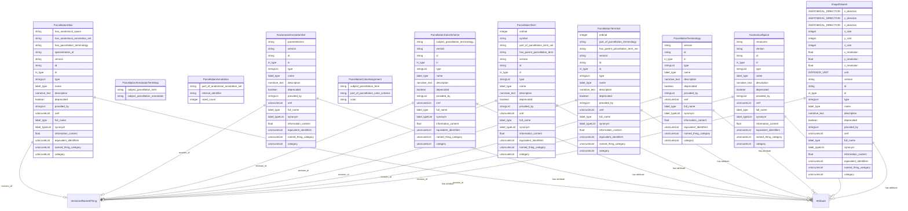

```mermaid
erDiagram
ParcellationAtlas {
    string has_anatomical_space  
    string has_anatomical_annotation_set  
    string has_parcellation_terminology  
    string specialization_of  
    string version  
    string id  
    iri_type iri  
    stringList type  
    label_type name  
    narrative_text description  
    boolean deprecated  
    stringList provided_by  
    uriorcurieList xref  
    label_type full_name  
    label_typeList synonym  
    float information_content  
    uriorcurieList equivalent_identifiers  
    uriorcurieList named_thing_category  
    uriorcurieList category  
}
ParcellationAnnotationTermMap {
    string subject_parcellation_term  
    string subject_parcellation_annotation  
}
ParcellationAnnotation {
    string part_of_anatomical_annotation_set  
    string internal_identifier  
    integer voxel_count  
}
AnatomicalAnnotationSet {
    string parameterizes  
    string version  
    string id  
    iri_type iri  
    stringList type  
    label_type name  
    narrative_text description  
    boolean deprecated  
    stringList provided_by  
    uriorcurieList xref  
    label_type full_name  
    label_typeList synonym  
    float information_content  
    uriorcurieList equivalent_identifiers  
    uriorcurieList named_thing_category  
    uriorcurieList category  
}
ParcellationColorAssignment {
    string subject_parcellation_term  
    string part_of_parcellation_color_scheme  
    string color  
}
ParcellationColorScheme {
    string subject_parcellation_terminology  
    string version  
    string id  
    iri_type iri  
    stringList type  
    label_type name  
    narrative_text description  
    boolean deprecated  
    stringList provided_by  
    uriorcurieList xref  
    label_type full_name  
    label_typeList synonym  
    float information_content  
    uriorcurieList equivalent_identifiers  
    uriorcurieList named_thing_category  
    uriorcurieList category  
}
ParcellationTerm {
    integer ordinal  
    string symbol  
    string part_of_parcellation_term_set  
    string has_parent_parcellation_term  
    string version  
    string id  
    iri_type iri  
    stringList type  
    label_type name  
    narrative_text description  
    boolean deprecated  
    stringList provided_by  
    uriorcurieList xref  
    label_type full_name  
    label_typeList synonym  
    float information_content  
    uriorcurieList equivalent_identifiers  
    uriorcurieList named_thing_category  
    uriorcurieList category  
}
ParcellationTermSet {
    integer ordinal  
    string part_of_parcellation_terminology  
    string has_parent_parcellation_term_set  
    string version  
    string id  
    iri_type iri  
    stringList type  
    label_type name  
    narrative_text description  
    boolean deprecated  
    stringList provided_by  
    uriorcurieList xref  
    label_type full_name  
    label_typeList synonym  
    float information_content  
    uriorcurieList equivalent_identifiers  
    uriorcurieList named_thing_category  
    uriorcurieList category  
}
ParcellationTerminology {
    string version  
    string id  
    iri_type iri  
    stringList type  
    label_type name  
    narrative_text description  
    boolean deprecated  
    stringList provided_by  
    uriorcurieList xref  
    label_type full_name  
    label_typeList synonym  
    float information_content  
    uriorcurieList equivalent_identifiers  
    uriorcurieList named_thing_category  
    uriorcurieList category  
}
AnatomicalSpace {
    string measures  
    string version  
    string id  
    iri_type iri  
    stringList type  
    label_type name  
    narrative_text description  
    boolean deprecated  
    stringList provided_by  
    uriorcurieList xref  
    label_type full_name  
    label_typeList synonym  
    float information_content  
    uriorcurieList equivalent_identifiers  
    uriorcurieList named_thing_category  
    uriorcurieList category  
}
ImageDataset {
    ANATOMICAL_DIRECTION x_direction  
    ANATOMICAL_DIRECTION y_direction  
    ANATOMICAL_DIRECTION z_direction  
    integer x_size  
    integer y_size  
    integer z_size  
    float x_resolution  
    float y_resolution  
    float z_resolution  
    DISTANCE_UNIT unit  
    string version  
    string id  
    iri_type iri  
    stringList type  
    label_type name  
    narrative_text description  
    boolean deprecated  
    stringList provided_by  
    uriorcurieList xref  
    label_type full_name  
    label_typeList synonym  
    float information_content  
    uriorcurieList equivalent_identifiers  
    uriorcurieList named_thing_category  
    uriorcurieList category  
}

ParcellationAtlas ||--|o VersionedNamedThing : "revision_of"
ParcellationAtlas ||--}o Attribute : "has attribute"
AnatomicalAnnotationSet ||--|o VersionedNamedThing : "revision_of"
AnatomicalAnnotationSet ||--}o Attribute : "has attribute"
ParcellationColorScheme ||--|o VersionedNamedThing : "revision_of"
ParcellationColorScheme ||--}o Attribute : "has attribute"
ParcellationTerm ||--|o VersionedNamedThing : "revision_of"
ParcellationTerm ||--}o Attribute : "has attribute"
ParcellationTermSet ||--|o VersionedNamedThing : "revision_of"
ParcellationTermSet ||--}o Attribute : "has attribute"
ParcellationTerminology ||--|o VersionedNamedThing : "revision_of"
ParcellationTerminology ||--}o Attribute : "has attribute"
AnatomicalSpace ||--|o VersionedNamedThing : "revision_of"
AnatomicalSpace ||--}o Attribute : "has attribute"
ImageDataset ||--|o VersionedNamedThing : "revision_of"
ImageDataset ||--}o Attribute : "has attribute"

```

