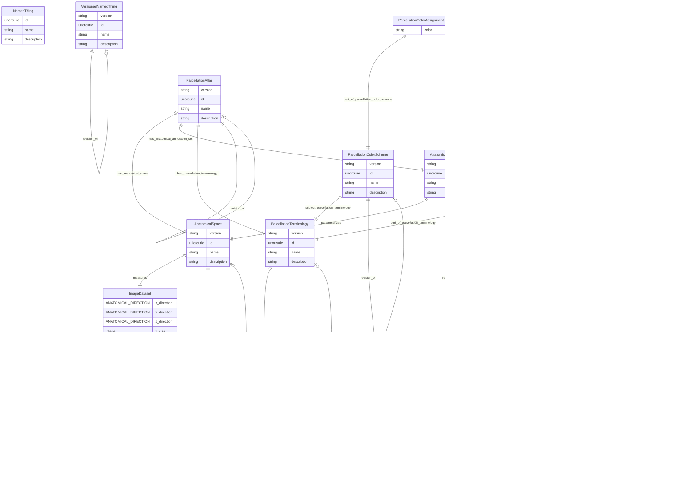

```mermaid
erDiagram
NamedThing {
    uriorcurie id  
    string name  
    string description  
}
VersionedNamedThing {
    string version  
    uriorcurie id  
    string name  
    string description  
}
ImageDataset {
    ANATOMICAL_DIRECTION x_direction  
    ANATOMICAL_DIRECTION y_direction  
    ANATOMICAL_DIRECTION z_direction  
    integer x_size  
    integer y_size  
    integer z_size  
    float x_resolution  
    float y_resolution  
    float z_resolution  
    DISTANCE_UNIT unit  
    string version  
    uriorcurie id  
    string name  
    string description  
}
AnatomicalSpace {
    string version  
    uriorcurie id  
    string name  
    string description  
}
ParcellationTerminology {
    string version  
    uriorcurie id  
    string name  
    string description  
}
ParcellationTermSet {
    integer ordinal  
    uriorcurie id  
    string name  
    string description  
}
ParcellationTerm {
    string symbol  
    integer ordinal  
    uriorcurie id  
    string name  
    string description  
}
ParcellationColorScheme {
    string version  
    uriorcurie id  
    string name  
    string description  
}
ParcellationColorAssignment {
    string color  
}
AnatomicalAnnotationSet {
    string version  
    uriorcurie id  
    string name  
    string description  
}
ParcellationAnnotation {
    string internal_identifier  
    integer voxel_count  
}
ParcellationAnnotationTermMap {

}
ParcellationAtlas {
    string version  
    uriorcurie id  
    string name  
    string description  
}

VersionedNamedThing ||--|o VersionedNamedThing : "revision_of"
ImageDataset ||--|o ImageDataset : "revision_of"
AnatomicalSpace ||--|| ImageDataset : "measures"
AnatomicalSpace ||--|o AnatomicalSpace : "revision_of"
ParcellationTerminology ||--|o ParcellationTerminology : "revision_of"
ParcellationTermSet ||--|| ParcellationTerminology : "part_of_parcellation_terminology"
ParcellationTermSet ||--|o ParcellationTermSet : "has_parent_parcellation_term_set"
ParcellationTerm ||--|| ParcellationTermSet : "part_of_parcellation_term_set"
ParcellationTerm ||--|o ParcellationTerm : "has_parent_parcellation_term"
ParcellationColorScheme ||--|| ParcellationTerminology : "subject_parcellation_terminology"
ParcellationColorScheme ||--|o ParcellationColorScheme : "revision_of"
ParcellationColorAssignment ||--|| ParcellationColorScheme : "part_of_parcellation_color_scheme"
ParcellationColorAssignment ||--|| ParcellationTerm : "subject_parcellation_term"
AnatomicalAnnotationSet ||--|| AnatomicalSpace : "parameterizes"
AnatomicalAnnotationSet ||--|o AnatomicalAnnotationSet : "revision_of"
ParcellationAnnotation ||--|| AnatomicalAnnotationSet : "part_of_anatomical_annotation_set"
ParcellationAnnotationTermMap ||--|| ParcellationAnnotation : "subject_parcellation_annotation"
ParcellationAnnotationTermMap ||--|| ParcellationTerm : "subject_parcellation_term"
ParcellationAtlas ||--|| AnatomicalSpace : "has_anatomical_space"
ParcellationAtlas ||--|| AnatomicalAnnotationSet : "has_anatomical_annotation_set"
ParcellationAtlas ||--|| ParcellationTerminology : "has_parcellation_terminology"
ParcellationAtlas ||--|o ParcellationAtlas : "specialization_of"
ParcellationAtlas ||--|o ParcellationAtlas : "revision_of"

```

