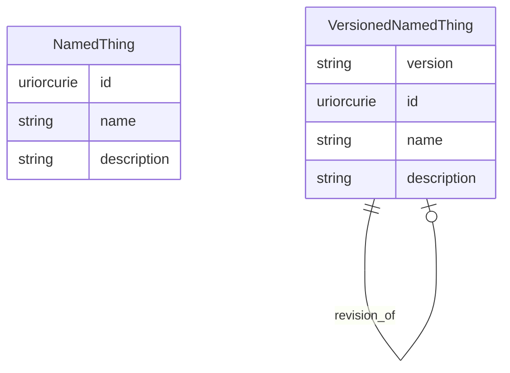

```mermaid
erDiagram
NamedThing {
    uriorcurie id  
    string name  
    string description  
}
VersionedNamedThing {
    string version  
    uriorcurie id  
    string name  
    string description  
}

VersionedNamedThing ||--|o VersionedNamedThing : "revision_of"

```

