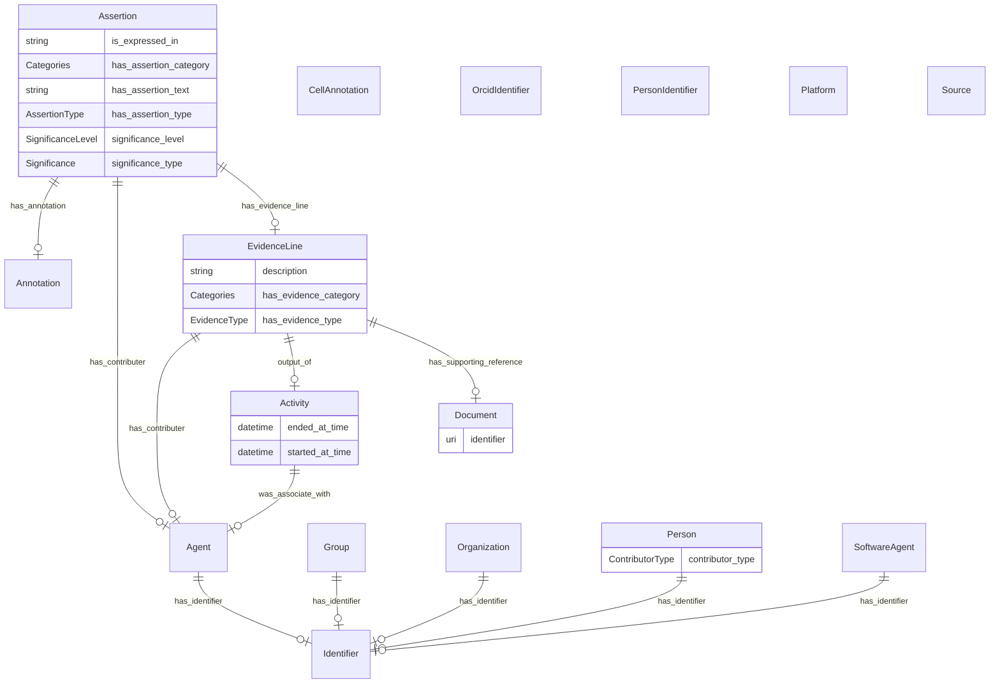

```mermaid
erDiagram
Activity {
    datetime ended_at_time  
    datetime started_at_time  
}
Agent {

}
Annotation {

}
Assertion {
    string is_expressed_in  
    Categories has_assertion_category  
    string has_assertion_text  
    AssertionType has_assertion_type  
    SignificanceLevel significance_level  
    Significance significance_type  
}
CellAnnotation {

}
Document {
    uri identifier  
}
EvidenceLine {
    string description  
    Categories has_evidence_category  
    EvidenceType has_evidence_type  
}
Group {

}
Identifier {

}
OrcidIdentifier {

}
Organization {

}
Person {
    ContributorType contributor_type  
}
PersonIdentifier {

}
Platform {

}
SoftwareAgent {

}
Source {

}

Activity ||--|o Agent : "was_associate_with"
Agent ||--|o Identifier : "has_identifier"
Assertion ||--|o Annotation : "has_annotation"
Assertion ||--|o Agent : "has_contributer"
Assertion ||--|o EvidenceLine : "has_evidence_line"
EvidenceLine ||--|o Agent : "has_contributer"
EvidenceLine ||--|o Activity : "output_of"
EvidenceLine ||--|o Document : "has_supporting_reference"
Group ||--|o Identifier : "has_identifier"
Organization ||--|o Identifier : "has_identifier"
Person ||--|o Identifier : "has_identifier"
SoftwareAgent ||--|o Identifier : "has_identifier"

```

