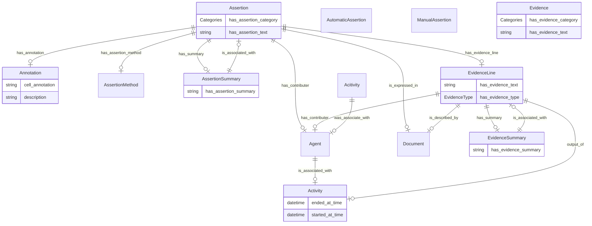

```mermaid
erDiagram
Activity {
    datetime ended_at_time  
    datetime started_at_time  
}
Agent {

}
Annotation {
    string cell_annotation  
    string description  
}
Assertion {
    Categories has_assertion_category  
    string has_assertion_text  
}
AssertionMethod {

}
AssertionSummary {
    string has_assertion_summary  
}
AutomaticAssertion {

}
Document {

}
EvidenceLine {
    string has_evidence_text  
    EvidenceType has_evidence_type  
}
EvidenceSummary {
    string has_evidence_summary  
}
ManualAssertion {

}
Acitivity {

}
Evidence {
    Categories has_evidence_category  
    string has_evidence_text  
}

Agent ||--|o Activity : "is_associated_with"
Assertion ||--|o Annotation : "has_annotation"
Assertion ||--|o AssertionMethod : "has_assertion_method"
Assertion ||--|o Agent : "has_contributer"
Assertion ||--|o AssertionSummary : "has_summary"
Assertion ||--|o Document : "is_expressed_in"
Assertion ||--|o EvidenceLine : "has_evidence_line"
AssertionSummary ||--|o Assertion : "is_associated_with"
EvidenceLine ||--|o Agent : "has_contributer"
EvidenceLine ||--|o EvidenceSummary : "has_summary"
EvidenceLine ||--|o Document : "is_described_by"
EvidenceLine ||--|o Activity : "output_of"
EvidenceSummary ||--|o EvidenceLine : "is_associated_with"
Acitivity ||--|o Agent : "was_associate_with"

```

