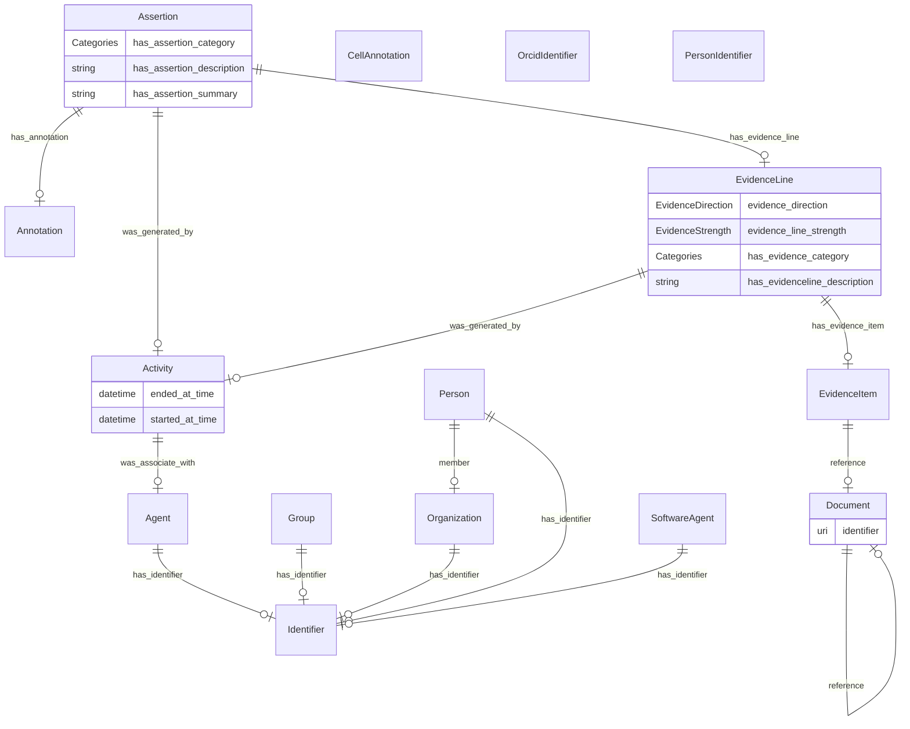

```mermaid
erDiagram
Activity {
    datetime ended_at_time  
    datetime started_at_time  
}
Agent {

}
Annotation {

}
Assertion {
    Categories has_assertion_category  
    string has_assertion_description  
    string has_assertion_summary  
}
CellAnnotation {

}
Document {
    uri identifier  
}
EvidenceItem {

}
EvidenceLine {
    EvidenceDirection evidence_direction  
    EvidenceStrength evidence_line_strength  
    Categories has_evidence_category  
    string has_evidenceline_description  
}
Group {

}
Identifier {

}
OrcidIdentifier {

}
Organization {

}
Person {

}
PersonIdentifier {

}
SoftwareAgent {

}

Activity ||--|o Agent : "was_associate_with"
Agent ||--|o Identifier : "has_identifier"
Assertion ||--|o Annotation : "has_annotation"
Assertion ||--|o Activity : "was_generated_by"
Assertion ||--|o EvidenceLine : "has_evidence_line"
Document ||--|o Document : "reference"
EvidenceItem ||--|o Document : "reference"
EvidenceLine ||--|o EvidenceItem : "has_evidence_item"
EvidenceLine ||--|o Activity : "was_generated_by"
Group ||--|o Identifier : "has_identifier"
Organization ||--|o Identifier : "has_identifier"
Person ||--|o Organization : "member"
Person ||--|o Identifier : "has_identifier"
SoftwareAgent ||--|o Identifier : "has_identifier"

```

