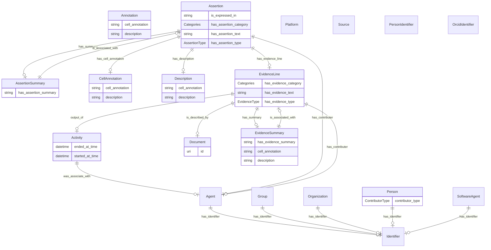

```mermaid
erDiagram
Activity {
    datetime ended_at_time  
    datetime started_at_time  
}
Agent {

}
Annotation {
    string cell_annotation  
    string description  
}
Assertion {
    string is_expressed_in  
    Categories has_assertion_category  
    string has_assertion_text  
    AssertionType has_assertion_type  
}
AssertionSummary {
    string has_assertion_summary  
}
CellAnnotation {
    string cell_annotation  
    string description  
}
Description {
    string cell_annotation  
    string description  
}
Document {
    uri id  
}
EvidenceLine {
    Categories has_evidence_category  
    string has_evidence_text  
    EvidenceType has_evidence_type  
}
EvidenceSummary {
    string has_evidence_summary  
    string cell_annotation  
    string description  
}
Group {

}
Organization {

}
Person {
    ContributorType contributor_type  
}
Platform {

}
SoftwareAgent {

}
Source {

}
Identifier {

}
PersonIdentifier {

}
OrcidIdentifier {

}

Activity ||--|o Agent : "was_associate_with"
Agent ||--|o Identifier : "has_identifier"
Assertion ||--|o CellAnnotation : "has_cell_annotation"
Assertion ||--|o Agent : "has_contributer"
Assertion ||--|o Description : "has_description"
Assertion ||--|o AssertionSummary : "has_summary"
Assertion ||--|o EvidenceLine : "has_evidence_line"
AssertionSummary ||--|o Assertion : "is_associated_with"
EvidenceLine ||--|o Agent : "has_contributer"
EvidenceLine ||--|o EvidenceSummary : "has_summary"
EvidenceLine ||--|o Document : "is_described_by"
EvidenceLine ||--|o Activity : "output_of"
EvidenceSummary ||--|o EvidenceLine : "is_associated_with"
Group ||--|o Identifier : "has_identifier"
Organization ||--|o Identifier : "has_identifier"
Person ||--|o Identifier : "has_identifier"
SoftwareAgent ||--|o Identifier : "has_identifier"

```

