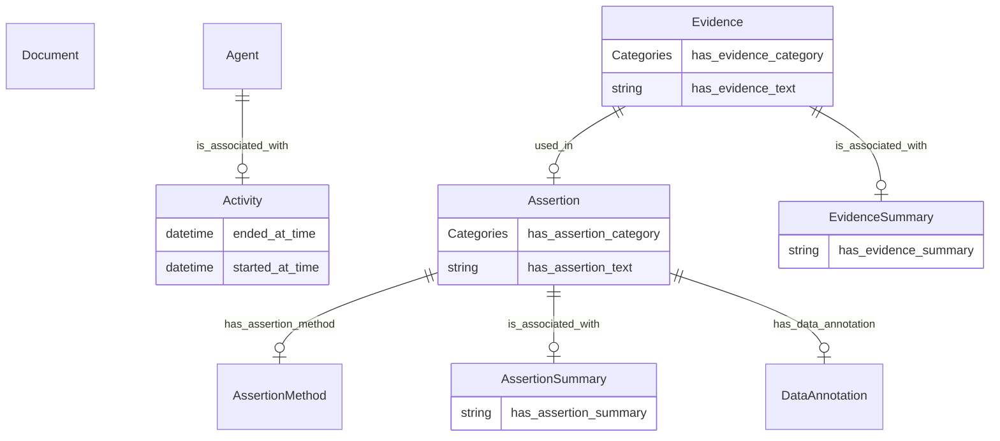

```mermaid
erDiagram
Assertion {
    Categories has_assertion_category  
    string has_assertion_text  
}
Document {

}
Activity {
    datetime ended_at_time  
    datetime started_at_time  
}
Agent {

}
AssertionSummary {
    string has_assertion_summary  
}
EvidenceSummary {
    string has_evidence_summary  
}
AssertionMethod {

}
DataAnnotation {

}
Evidence {
    Categories has_evidence_category  
    string has_evidence_text  
}

Assertion ||--|o AssertionMethod : "has_assertion_method"
Assertion ||--|o AssertionSummary : "is_associated_with"
Assertion ||--|o DataAnnotation : "has_data_annotation"
Agent ||--|o Activity : "is_associated_with"
Evidence ||--|o Assertion : "used_in"
Evidence ||--|o EvidenceSummary : "is_associated_with"

```

