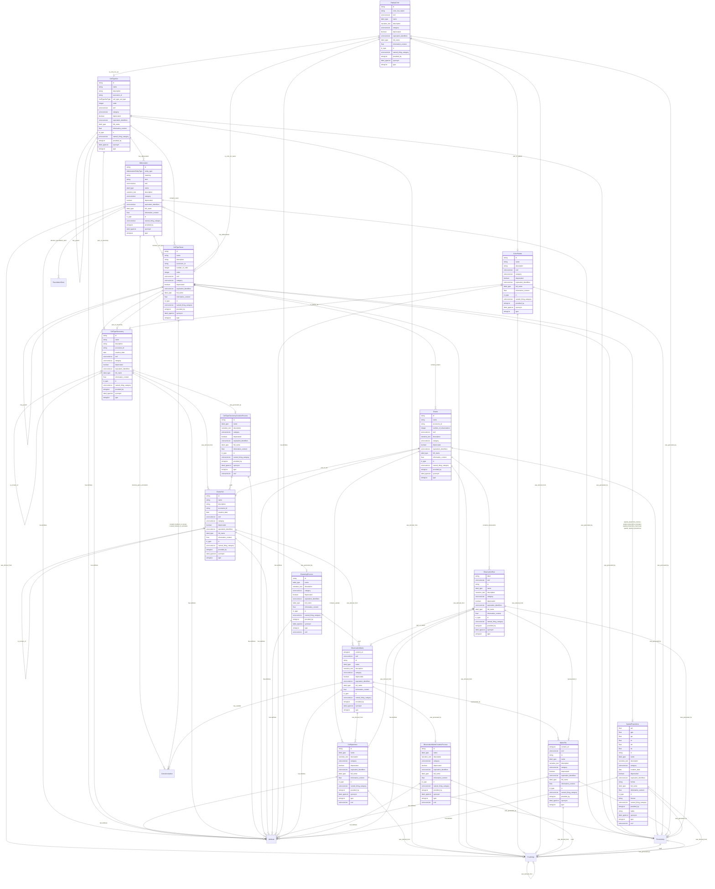

```mermaid
erDiagram
Abbreviation {
    string id  
    AbbreviationEntityType entity_type  
    string meaning  
    string term  
    uriorcurieList xref  
    label_type name  
    narrative_text description  
    uriorcurieList category  
    boolean deprecated  
    uriorcurieList equivalent_identifiers  
    label_type full_name  
    float information_content  
    iri_type iri  
    uriorcurieList named_thing_category  
    stringList provided_by  
    label_typeList synonym  
    stringList type  
}
CellSpecimen {
    string id  
    label_type name  
    narrative_text description  
    uriorcurieList category  
    boolean deprecated  
    uriorcurieList equivalent_identifiers  
    label_type full_name  
    float information_content  
    iri_type iri  
    uriorcurieList named_thing_category  
    stringList provided_by  
    label_typeList synonym  
    stringList type  
    uriorcurieList xref  
}
CellTypeSet {
    string id  
    string name  
    string description  
    string accession_id  
    CellTypeSetType cell_type_set_type  
    integer order  
    uriorcurieList xref  
    uriorcurieList category  
    boolean deprecated  
    uriorcurieList equivalent_identifiers  
    label_type full_name  
    float information_content  
    iri_type iri  
    uriorcurieList named_thing_category  
    stringList provided_by  
    label_typeList synonym  
    stringList type  
}
CellTypeTaxon {
    string id  
    string name  
    string description  
    string accession_id  
    integer number_of_cells  
    integer order  
    uriorcurieList xref  
    uriorcurieList category  
    boolean deprecated  
    uriorcurieList equivalent_identifiers  
    label_type full_name  
    float information_content  
    iri_type iri  
    uriorcurieList named_thing_category  
    stringList provided_by  
    label_typeList synonym  
    stringList type  
}
CellTypeTaxonomy {
    string id  
    string name  
    string description  
    string accession_id  
    date creation_date  
    uriorcurieList xref  
    uriorcurieList category  
    boolean deprecated  
    uriorcurieList equivalent_identifiers  
    label_type full_name  
    float information_content  
    iri_type iri  
    uriorcurieList named_thing_category  
    stringList provided_by  
    label_typeList synonym  
    stringList type  
}
CellTypeTaxonomyCreationProcess {
    string id  
    label_type name  
    narrative_text description  
    uriorcurieList category  
    boolean deprecated  
    uriorcurieList equivalent_identifiers  
    label_type full_name  
    float information_content  
    iri_type iri  
    uriorcurieList named_thing_category  
    stringList provided_by  
    label_typeList synonym  
    stringList type  
    uriorcurieList xref  
}
Cluster {
    string id  
    string name  
    string accession_id  
    integer number_of_observations  
    uriorcurieList xref  
    narrative_text description  
    uriorcurieList category  
    boolean deprecated  
    uriorcurieList equivalent_identifiers  
    label_type full_name  
    float information_content  
    iri_type iri  
    uriorcurieList named_thing_category  
    stringList provided_by  
    label_typeList synonym  
    stringList type  
}
ClusterSet {
    string id  
    string name  
    string description  
    string accession_id  
    date creation_date  
    uriorcurieList xref  
    uriorcurieList category  
    boolean deprecated  
    uriorcurieList equivalent_identifiers  
    label_type full_name  
    float information_content  
    iri_type iri  
    uriorcurieList named_thing_category  
    stringList provided_by  
    label_typeList synonym  
    stringList type  
}
ClusteringProcess {
    string id  
    label_type name  
    narrative_text description  
    uriorcurieList category  
    boolean deprecated  
    uriorcurieList equivalent_identifiers  
    label_type full_name  
    float information_content  
    iri_type iri  
    uriorcurieList named_thing_category  
    stringList provided_by  
    label_typeList synonym  
    stringList type  
    uriorcurieList xref  
}
ColorPalette {
    string id  
    string name  
    string description  
    uriorcurieList xref  
    uriorcurieList category  
    boolean deprecated  
    uriorcurieList equivalent_identifiers  
    label_type full_name  
    float information_content  
    iri_type iri  
    uriorcurieList named_thing_category  
    stringList provided_by  
    label_typeList synonym  
    stringList type  
}
DisplayColor {
    string id  
    string color_hex_triplet  
    uriorcurieList xref  
    label_type name  
    narrative_text description  
    uriorcurieList category  
    boolean deprecated  
    uriorcurieList equivalent_identifiers  
    label_type full_name  
    float information_content  
    iri_type iri  
    uriorcurieList named_thing_category  
    stringList provided_by  
    label_typeList synonym  
    stringList type  
}
MatrixFile {
    stringList content_url  
    uriorcurieList xref  
    string id  
    label_type name  
    narrative_text description  
    uriorcurieList category  
    boolean deprecated  
    uriorcurieList equivalent_identifiers  
    label_type full_name  
    float information_content  
    iri_type iri  
    uriorcurieList named_thing_category  
    stringList provided_by  
    label_typeList synonym  
    stringList type  
}
ObservationMatrix {
    stringList content_url  
    uriorcurieList xref  
    string id  
    label_type name  
    narrative_text description  
    uriorcurieList category  
    boolean deprecated  
    uriorcurieList equivalent_identifiers  
    label_type full_name  
    float information_content  
    iri_type iri  
    uriorcurieList named_thing_category  
    stringList provided_by  
    label_typeList synonym  
    stringList type  
}
ObservationMatrixCreationProcess {
    string id  
    label_type name  
    narrative_text description  
    uriorcurieList category  
    boolean deprecated  
    uriorcurieList equivalent_identifiers  
    label_type full_name  
    float information_content  
    iri_type iri  
    uriorcurieList named_thing_category  
    stringList provided_by  
    label_typeList synonym  
    stringList type  
    uriorcurieList xref  
}
ObservationRow {
    string label  
    uriorcurieList xref  
    string id  
    label_type name  
    narrative_text description  
    uriorcurieList category  
    boolean deprecated  
    uriorcurieList equivalent_identifiers  
    label_type full_name  
    float information_content  
    iri_type iri  
    uriorcurieList named_thing_category  
    stringList provided_by  
    label_typeList synonym  
    stringList type  
}
ProvActivity {

}
ProvEntity {

}
SpatialProportions {
    float adj  
    float gpe  
    float gpi  
    float sn  
    float sth  
    float str  
    string id  
    label_type name  
    narrative_text description  
    uriorcurieList category  
    date creation_date  
    boolean deprecated  
    uriorcurieList equivalent_identifiers  
    string format  
    label_type full_name  
    float information_content  
    iri_type iri  
    string license  
    uriorcurieList named_thing_category  
    stringList provided_by  
    string rights  
    label_typeList synonym  
    stringList type  
    uriorcurieList xref  
}

Abbreviation ||--|o ProvActivity : "was_generated_by"
Abbreviation ||--|o ProvEntity : "was_derived_from"
Abbreviation ||--}o Attribute : "has attribute"
Abbreviation ||--}o CellTypeTaxon : "denotes_cell_type"
Abbreviation ||--}o GeneAnnotation : "denotes_gene_annotation"
Abbreviation ||--}o ParcellationTerm : "denotes_parcellation_term"
CellSpecimen ||--|o ProvActivity : "was_generated_by"
CellSpecimen ||--|o ProvEntity : "was_derived_from"
CellSpecimen ||--}o Attribute : "has attribute"
CellTypeSet ||--|o CellTypeSet : "has_parent"
CellTypeSet ||--|o CellTypeTaxonomy : "part_of_taxonomy"
CellTypeSet ||--|o ProvActivity : "was_generated_by"
CellTypeSet ||--|o ProvEntity : "was_derived_from"
CellTypeSet ||--}o Abbreviation : "has_abbreviation"
CellTypeSet ||--}o Attribute : "has attribute"
CellTypeSet ||--}o CellTypeTaxon : "contains_taxon"
CellTypeTaxon ||--|o CellTypeTaxon : "has_parent"
CellTypeTaxon ||--|o CellTypeTaxonomy : "part_of_taxonomy"
CellTypeTaxon ||--|o ProvActivity : "was_generated_by"
CellTypeTaxon ||--|o ProvEntity : "was_derived_from"
CellTypeTaxon ||--|o SpatialProportions : "spatial_proportions_human, spatial_proportions_macaque, spatial_proportions_marmoset, spatial_regional_proportions"
CellTypeTaxon ||--}o Abbreviation : "has_abbreviation"
CellTypeTaxon ||--}o Attribute : "has attribute"
CellTypeTaxon ||--}o Cluster : "contains_cluster"
CellTypeTaxon ||--}o GeneAnnotation : "curated_markers_to_mouse, curated_markers_to_primates"
CellTypeTaxonomy ||--|o CellTypeTaxonomy : "is_revision_of"
CellTypeTaxonomy ||--|o CellTypeTaxonomyCreationProcess : "was_generated_by"
CellTypeTaxonomy ||--}o Attribute : "has attribute"
CellTypeTaxonomy ||--}o ClusterSet : "was_derived_from"
CellTypeTaxonomyCreationProcess ||--}o Attribute : "has attribute"
CellTypeTaxonomyCreationProcess ||--}o ClusterSet : "used"
Cluster ||--|o ClusterSet : "part_of_set"
Cluster ||--|o ProvActivity : "was_generated_by"
Cluster ||--|o ProvEntity : "was_derived_from"
Cluster ||--}o Attribute : "has attribute"
Cluster ||--}o CellSpecimen : "contains_sample"
Cluster ||--}o ObservationRow : "contains_observation"
ClusterSet ||--|o ClusterSet : "is_revision_of"
ClusterSet ||--|o ClusteringProcess : "was_generated_by"
ClusterSet ||--}o Attribute : "has attribute"
ClusterSet ||--}o ObservationMatrix : "was_derived_from"
ClusteringProcess ||--}o Attribute : "has attribute"
ClusteringProcess ||--}o ObservationMatrix : "used"
ColorPalette ||--|o CellTypeTaxonomy : "is_palette_for"
ColorPalette ||--|o ProvActivity : "was_generated_by"
ColorPalette ||--|o ProvEntity : "was_derived_from"
ColorPalette ||--}o Attribute : "has attribute"
DisplayColor ||--|o CellTypeSet : "is_color_for_set"
DisplayColor ||--|o CellTypeTaxon : "is_color_for_taxon"
DisplayColor ||--|o ColorPalette : "part_of_palette"
DisplayColor ||--|o ProvActivity : "was_generated_by"
DisplayColor ||--|o ProvEntity : "was_derived_from"
DisplayColor ||--}o Attribute : "has attribute"
MatrixFile ||--|o ProvActivity : "was_generated_by"
MatrixFile ||--|o ProvEntity : "was_derived_from"
MatrixFile ||--}o Attribute : "has attribute"
ObservationMatrix ||--|o ObservationMatrixCreationProcess : "was_generated_by"
ObservationMatrix ||--}o Attribute : "has attribute"
ObservationMatrix ||--}o CellSpecimen : "was_derived_from"
ObservationMatrix ||--}o GeneAnnotation : "has_variable"
ObservationMatrix ||--}o MatrixFile : "represented_by"
ObservationMatrixCreationProcess ||--|o ProvEntity : "used"
ObservationMatrixCreationProcess ||--}o Attribute : "has attribute"
ObservationRow ||--|o CellSpecimen : "was_derived_from"
ObservationRow ||--|o MatrixFile : "represented_in"
ObservationRow ||--|o ObservationMatrix : "part_of_matrix"
ObservationRow ||--|o ProvActivity : "was_generated_by"
ObservationRow ||--}o Attribute : "has attribute"
ProvActivity ||--|o ProvEntity : "used"
ProvEntity ||--|o ProvActivity : "was_generated_by"
ProvEntity ||--|o ProvEntity : "was_derived_from"
SpatialProportions ||--|o ProvActivity : "was_generated_by"
SpatialProportions ||--|o ProvEntity : "was_derived_from"
SpatialProportions ||--}o Attribute : "has attribute"

```

