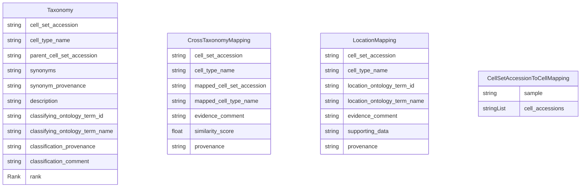

```mermaid
erDiagram
Taxonomy {
    string cell_set_accession  
    string cell_type_name  
    string parent_cell_set_accession  
    string synonyms  
    string synonym_provenance  
    string description  
    string classifying_ontology_term_id  
    string classifying_ontology_term_name  
    string classification_provenance  
    string classification_comment  
    Rank rank  
}
CrossTaxonomyMapping {
    string cell_set_accession  
    string cell_type_name  
    string mapped_cell_set_accession  
    string mapped_cell_type_name  
    string evidence_comment  
    float similarity_score  
    string provenance  
}
LocationMapping {
    string cell_set_accession  
    string cell_type_name  
    string location_ontology_term_id  
    string location_ontology_term_name  
    string evidence_comment  
    string supporting_data  
    string provenance  
}
CellSetAccessionToCellMapping {
    string sample  
    stringList cell_accessions  
}


```

