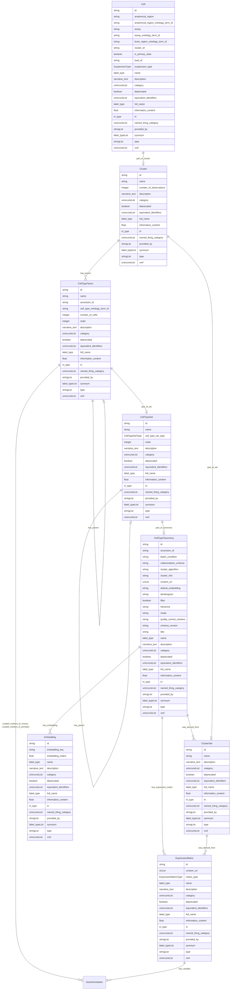

```mermaid
erDiagram
Cell {
    string id  
    string anatomical_region  
    string anatomical_region_ontology_term_id  
    string assay  
    string assay_ontology_term_id  
    string brain_region_ontology_term_id  
    string cluster_id  
    boolean is_primary_data  
    string load_id  
    SuspensionType suspension_type  
    label_type name  
    narrative_text description  
    uriorcurieList category  
    boolean deprecated  
    uriorcurieList equivalent_identifiers  
    label_type full_name  
    float information_content  
    iri_type iri  
    uriorcurieList named_thing_category  
    stringList provided_by  
    label_typeList synonym  
    stringList type  
    uriorcurieList xref  
}
CellTypeSet {
    string id  
    string name  
    CellTypeSetType cell_type_set_type  
    integer order  
    narrative_text description  
    uriorcurieList category  
    boolean deprecated  
    uriorcurieList equivalent_identifiers  
    label_type full_name  
    float information_content  
    iri_type iri  
    uriorcurieList named_thing_category  
    stringList provided_by  
    label_typeList synonym  
    stringList type  
    uriorcurieList xref  
}
CellTypeTaxon {
    string id  
    string name  
    string accession_id  
    string cell_type_ontology_term_id  
    integer number_of_cells  
    integer order  
    narrative_text description  
    uriorcurieList category  
    boolean deprecated  
    uriorcurieList equivalent_identifiers  
    label_type full_name  
    float information_content  
    iri_type iri  
    uriorcurieList named_thing_category  
    stringList provided_by  
    label_typeList synonym  
    stringList type  
    uriorcurieList xref  
}
CellTypeTaxonomy {
    string id  
    string accession_id  
    string batch_condition  
    string cellannotation_schema  
    string cluster_algorithm  
    string cluster_info  
    uriList content_url  
    string default_embedding  
    string dendrogram  
    boolean filter  
    string hierarchy  
    string mode  
    string quality_control_markers  
    string schema_version  
    string title  
    label_type name  
    narrative_text description  
    uriorcurieList category  
    boolean deprecated  
    uriorcurieList equivalent_identifiers  
    label_type full_name  
    float information_content  
    iri_type iri  
    uriorcurieList named_thing_category  
    stringList provided_by  
    label_typeList synonym  
    stringList type  
    uriorcurieList xref  
}
Cluster {
    string id  
    string name  
    integer number_of_observations  
    narrative_text description  
    uriorcurieList category  
    boolean deprecated  
    uriorcurieList equivalent_identifiers  
    label_type full_name  
    float information_content  
    iri_type iri  
    uriorcurieList named_thing_category  
    stringList provided_by  
    label_typeList synonym  
    stringList type  
    uriorcurieList xref  
}
ClusterSet {
    string id  
    string name  
    narrative_text description  
    uriorcurieList category  
    boolean deprecated  
    uriorcurieList equivalent_identifiers  
    label_type full_name  
    float information_content  
    iri_type iri  
    uriorcurieList named_thing_category  
    stringList provided_by  
    label_typeList synonym  
    stringList type  
    uriorcurieList xref  
}
Embedding {
    string id  
    string embedding_key  
    float embedding_matrix  
    label_type name  
    narrative_text description  
    uriorcurieList category  
    boolean deprecated  
    uriorcurieList equivalent_identifiers  
    label_type full_name  
    float information_content  
    iri_type iri  
    uriorcurieList named_thing_category  
    stringList provided_by  
    label_typeList synonym  
    stringList type  
    uriorcurieList xref  
}
ExpressionMatrix {
    string id  
    uriList content_url  
    ExpressionMatrixType matrix_type  
    label_type name  
    narrative_text description  
    uriorcurieList category  
    boolean deprecated  
    uriorcurieList equivalent_identifiers  
    label_type full_name  
    float information_content  
    iri_type iri  
    uriorcurieList named_thing_category  
    stringList provided_by  
    label_typeList synonym  
    stringList type  
    uriorcurieList xref  
}

Cell ||--|o Cluster : "part_of_cluster"
CellTypeSet ||--|o CellTypeSet : "has_parent"
CellTypeSet ||--|o CellTypeTaxonomy : "part_of_taxonomy"
CellTypeTaxon ||--|o CellTypeSet : "part_of_set"
CellTypeTaxon ||--|o CellTypeTaxon : "has_parent"
CellTypeTaxon ||--}o GeneAnnotation : "curated_markers_to_mouse, curated_markers_to_primates"
CellTypeTaxonomy ||--}o ClusterSet : "was_derived_from"
CellTypeTaxonomy ||--}o Embedding : "has_embedding"
CellTypeTaxonomy ||--}o ExpressionMatrix : "has_expression_matrix"
Cluster ||--|o ClusterSet : "part_of_set"
Cluster ||--}o CellTypeTaxon : "has_parent"
ClusterSet ||--}o ExpressionMatrix : "was_derived_from"
ExpressionMatrix ||--}o GeneAnnotation : "has_variable"

```
