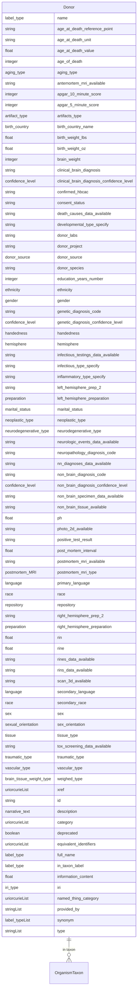

```mermaid
erDiagram
Donor {
    label_type name  
    string age_at_death_reference_point  
    string age_at_death_unit  
    float age_at_death_value  
    integer age_of_death  
    aging_type aging_type  
    string antemortem_mri_available  
    integer apgar_10_minute_score  
    integer apgar_5_minute_score  
    artifact_type artifacts_type  
    birth_country birth_country_name  
    float birth_weight_lbs  
    float birth_weight_oz  
    integer brain_weight  
    string clinical_brain_diagnosis  
    confidence_level clinical_brain_diagnosis_confidence_level  
    string confirmed_hbcac  
    string consent_status  
    string death_causes_data_available  
    string developmental_type_specify  
    string donor_labs  
    string donor_project  
    donor_source donor_source  
    string donor_species  
    integer education_years_number  
    ethnicity ethnicity  
    gender gender  
    string genetic_diagnosis_code  
    confidence_level genetic_diagnosis_confidence_level  
    handedness handedness  
    hemisphere hemisphere  
    string infectious_testings_data_available  
    string infectious_type_specify  
    string inflammatory_type_specify  
    string left_hemisphere_prep_2  
    preparation left_hemisphere_preparation  
    marital_status marital_status  
    neoplastic_type neoplastic_type  
    neurodegenerative_type neurodegenerative_type  
    string neurologic_events_data_available  
    string neuropathology_diagnosis_code  
    string nn_diagnoses_data_available  
    string non_brain_diagnosis_code  
    confidence_level non_brain_diagnosis_confidence_level  
    string non_brain_specimen_data_available  
    string non_brain_tissue_available  
    float ph  
    string photo_2d_available  
    string positive_test_result  
    float post_mortem_interval  
    string postmortem_mri_available  
    postmortem_MRI postmortem_mri_type  
    language primary_language  
    race race  
    repository repository  
    string right_hemisphere_prep_2  
    preparation right_hemisphere_preparation  
    float rin  
    float rine  
    string rines_data_available  
    string rins_data_available  
    string scan_3d_available  
    language secondary_language  
    race secondary_race  
    sex sex  
    sexual_orientation sex_orientation  
    tissue tissue_type  
    string tox_screening_data_available  
    traumatic_type traumatic_type  
    vascular_type vascular_type  
    brain_tissue_weight_type weighed_type  
    uriorcurieList xref  
    string id  
    narrative_text description  
    uriorcurieList category  
    boolean deprecated  
    uriorcurieList equivalent_identifiers  
    label_type full_name  
    label_type in_taxon_label  
    float information_content  
    iri_type iri  
    uriorcurieList named_thing_category  
    stringList provided_by  
    label_typeList synonym  
    stringList type  
}

Donor ||--}o OrganismTaxon : "in taxon"

```
