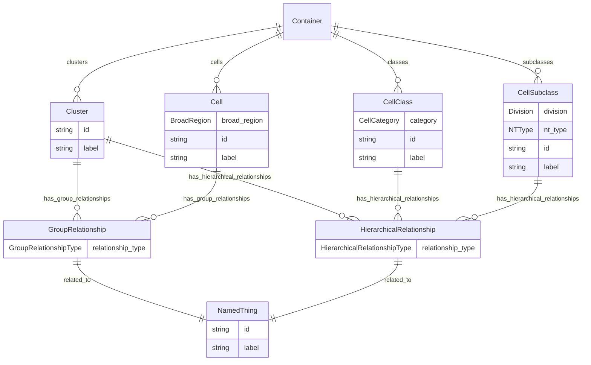

```mermaid
erDiagram
Container {

}
Cluster {
    string id  
    string label  
}
GroupRelationship {
    GroupRelationshipType relationship_type  
}
NamedThing {
    string id  
    string label  
}
HierarchicalRelationship {
    HierarchicalRelationshipType relationship_type  
}
Cell {
    BroadRegion broad_region  
    string id  
    string label  
}
CellClass {
    CellCategory category  
    string id  
    string label  
}
CellSubclass {
    Division division  
    NTType nt_type  
    string id  
    string label  
}

Container ||--}o CellSubclass : "subclasses"
Container ||--}o CellClass : "classes"
Container ||--}o Cell : "cells"
Container ||--}o Cluster : "clusters"
Cluster ||--}o HierarchicalRelationship : "has_hierarchical_relationships"
Cluster ||--}o GroupRelationship : "has_group_relationships"
GroupRelationship ||--|| NamedThing : "related_to"
HierarchicalRelationship ||--|| NamedThing : "related_to"
Cell ||--}o GroupRelationship : "has_group_relationships"
CellClass ||--}o HierarchicalRelationship : "has_hierarchical_relationships"
CellSubclass ||--}o HierarchicalRelationship : "has_hierarchical_relationships"

```

