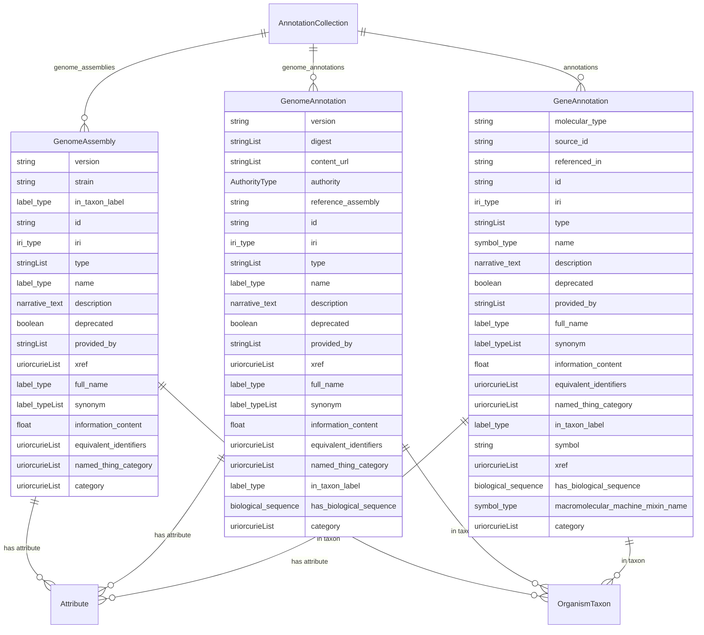

```mermaid
erDiagram
AnnotationCollection {

}
GenomeAssembly {
    string version  
    string strain  
    label_type in_taxon_label  
    string id  
    iri_type iri  
    stringList type  
    label_type name  
    narrative_text description  
    boolean deprecated  
    stringList provided_by  
    uriorcurieList xref  
    label_type full_name  
    label_typeList synonym  
    float information_content  
    uriorcurieList equivalent_identifiers  
    uriorcurieList named_thing_category  
    uriorcurieList category  
}
GenomeAnnotation {
    string version  
    stringList digest  
    stringList content_url  
    AuthorityType authority  
    string reference_assembly  
    string id  
    iri_type iri  
    stringList type  
    label_type name  
    narrative_text description  
    boolean deprecated  
    stringList provided_by  
    uriorcurieList xref  
    label_type full_name  
    label_typeList synonym  
    float information_content  
    uriorcurieList equivalent_identifiers  
    uriorcurieList named_thing_category  
    label_type in_taxon_label  
    biological_sequence has_biological_sequence  
    uriorcurieList category  
}
GeneAnnotation {
    string molecular_type  
    string source_id  
    string referenced_in  
    string id  
    iri_type iri  
    stringList type  
    symbol_type name  
    narrative_text description  
    boolean deprecated  
    stringList provided_by  
    label_type full_name  
    label_typeList synonym  
    float information_content  
    uriorcurieList equivalent_identifiers  
    uriorcurieList named_thing_category  
    label_type in_taxon_label  
    string symbol  
    uriorcurieList xref  
    biological_sequence has_biological_sequence  
    symbol_type macromolecular_machine_mixin_name  
    uriorcurieList category  
}

AnnotationCollection ||--}o GeneAnnotation : "annotations"
AnnotationCollection ||--}o GenomeAnnotation : "genome_annotations"
AnnotationCollection ||--}o GenomeAssembly : "genome_assemblies"
GenomeAssembly ||--}o OrganismTaxon : "in taxon"
GenomeAssembly ||--}o Attribute : "has attribute"
GenomeAnnotation ||--}o Attribute : "has attribute"
GenomeAnnotation ||--}o OrganismTaxon : "in taxon"
GeneAnnotation ||--}o Attribute : "has attribute"
GeneAnnotation ||--}o OrganismTaxon : "in taxon"

```

