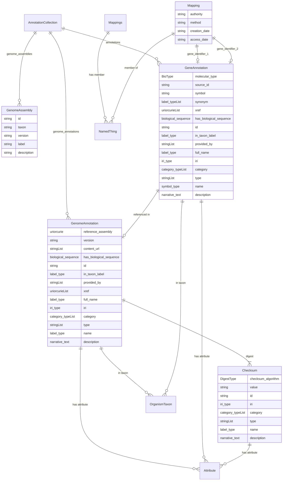

```mermaid
erDiagram
AnnotationCollection {

}
GenomeAssembly {
    string id  
    string taxon  
    string version  
    string label  
    string description  
}
GenomeAnnotation {
    uriorcurie reference_assembly  
    string version  
    stringList content_url  
    biological_sequence has_biological_sequence  
    string id  
    label_type in_taxon_label  
    stringList provided_by  
    uriorcurieList xref  
    label_type full_name  
    iri_type iri  
    category_typeList category  
    stringList type  
    label_type name  
    narrative_text description  
}
GeneAnnotation {
    BioType molecular_type  
    string source_id  
    string symbol  
    label_typeList synonym  
    uriorcurieList xref  
    biological_sequence has_biological_sequence  
    string id  
    label_type in_taxon_label  
    stringList provided_by  
    label_type full_name  
    iri_type iri  
    category_typeList category  
    stringList type  
    symbol_type name  
    narrative_text description  
}
Mappings {

}
Mapping {
    string authority  
    string method  
    string creation_date  
    string access_date  
}
Checksum {
    DigestType checksum_algorithm  
    string value  
    string id  
    iri_type iri  
    category_typeList category  
    stringList type  
    label_type name  
    narrative_text description  
}

AnnotationCollection ||--}o GeneAnnotation : "annotations"
AnnotationCollection ||--}o GenomeAnnotation : "genome_annotations"
AnnotationCollection ||--}o GenomeAssembly : "genome_assemblies"
GenomeAnnotation ||--}| Checksum : "digest"
GenomeAnnotation ||--}o OrganismTaxon : "in taxon"
GenomeAnnotation ||--}o Attribute : "has attribute"
GeneAnnotation ||--|o GenomeAnnotation : "referenced in"
GeneAnnotation ||--}o OrganismTaxon : "in taxon"
GeneAnnotation ||--}o Attribute : "has attribute"
Mappings ||--}o NamedThing : "has member"
Mapping ||--|o GeneAnnotation : "gene_identifier_1"
Mapping ||--|o GeneAnnotation : "gene_identifier_2"
Mapping ||--}o NamedThing : "member of"
Checksum ||--}o Attribute : "has attribute"

```

