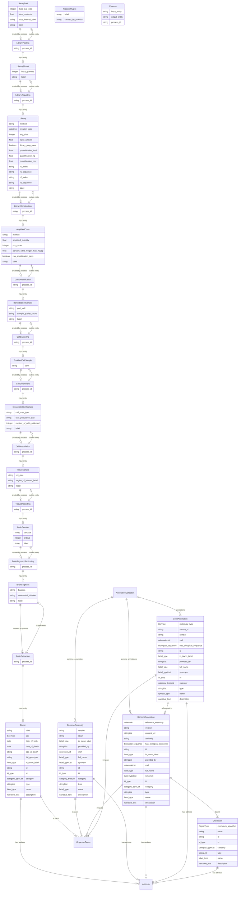

```mermaid
erDiagram
LibraryPool {
    integer tube_avg_size  
    float tube_contents  
    string tube_internal_label  
    string label  
}
LibraryPooling {
    string process_id  
}
LibraryAliquot {
    integer input_quantity  
    string label  
}
LibraryAliquoting {
    string process_id  
}
Library {
    string method  
    datetime creation_date  
    integer avg_size  
    float input_amount  
    boolean library_prep_pass  
    float quantification_fmol  
    float quantification_ng  
    float quantification_nm  
    string r1_index  
    string r1_sequence  
    string r2_index  
    string r2_sequence  
    string label  
}
LibraryConstruction {
    string process_id  
}
AmplifiedCdna {
    string method  
    float amplified_quantity  
    integer pcr_cycles  
    float percent_cdna_longer_than_400bp  
    boolean rna_amplification_pass  
    string label  
}
CdnaAmplification {
    string process_id  
}
BarcodedCellSample {
    string port_well  
    string sample_quality_count  
    string label  
}
CellBarcoding {
    string process_id  
}
EnrichedCellSample {
    string label  
}
CellEnrichment {
    string process_id  
}
DissociatedCellSample {
    string cell_prep_type  
    string facs_population_plan  
    integer number_of_cells_collected  
    string label  
}
CellDissociation {
    string process_id  
}
TissueSample {
    string roi_plan  
    string region_of_interest_label  
    string label  
}
TissueDissecting {
    string process_id  
}
BrainSection {
    string barcode  
    integer ordinal  
    string label  
}
BrainSegmentSectioning {
    string process_id  
}
BrainSegment {
    string barcode  
    string anatomical_division  
    string label  
}
BrainExtraction {
    string process_id  
}
Donor {
    string label  
    SexType sex  
    date date_of_birth  
    date date_of_death  
    string age_at_death  
    string full_genotype  
    label_type in_taxon_label  
    string id  
    iri_type iri  
    category_typeList category  
    stringList type  
    label_type name  
    narrative_text description  
}
ProcessOutput {
    string label  
    string created_by_process  
}
Process {
    string input_entity  
    string output_entity  
    string process_id  
}
AnnotationCollection {

}
GenomeAssembly {
    string version  
    string strain  
    label_type in_taxon_label  
    stringList provided_by  
    uriorcurieList xref  
    label_type full_name  
    label_typeList synonym  
    string id  
    iri_type iri  
    category_typeList category  
    stringList type  
    label_type name  
    narrative_text description  
}
GenomeAnnotation {
    uriorcurie reference_assembly  
    string version  
    stringList content_url  
    string authority  
    biological_sequence has_biological_sequence  
    string id  
    label_type in_taxon_label  
    stringList provided_by  
    uriorcurieList xref  
    label_type full_name  
    label_typeList synonym  
    iri_type iri  
    category_typeList category  
    stringList type  
    label_type name  
    narrative_text description  
}
GeneAnnotation {
    BioType molecular_type  
    string source_id  
    string symbol  
    uriorcurieList xref  
    biological_sequence has_biological_sequence  
    string id  
    label_type in_taxon_label  
    stringList provided_by  
    label_type full_name  
    label_typeList synonym  
    iri_type iri  
    category_typeList category  
    stringList type  
    symbol_type name  
    narrative_text description  
}
Checksum {
    DigestType checksum_algorithm  
    string value  
    string id  
    iri_type iri  
    category_typeList category  
    stringList type  
    label_type name  
    narrative_text description  
}

LibraryPool ||--|o LibraryPooling : "created by process"
LibraryPooling ||--|o LibraryAliquot : "input entity"
LibraryPooling ||--|o LibraryPool : "output entity"
LibraryAliquot ||--|o LibraryAliquoting : "created by process"
LibraryAliquoting ||--|o Library : "input entity"
LibraryAliquoting ||--|o LibraryAliquot : "output entity"
Library ||--|o LibraryConstruction : "created by process"
LibraryConstruction ||--|o AmplifiedCdna : "input entity"
LibraryConstruction ||--|o Library : "output entity"
AmplifiedCdna ||--|o CdnaAmplification : "created by process"
CdnaAmplification ||--|o BarcodedCellSample : "input entity"
CdnaAmplification ||--|o AmplifiedCdna : "output entity"
BarcodedCellSample ||--|o CellBarcoding : "created by process"
CellBarcoding ||--|o EnrichedCellSample : "input entity"
CellBarcoding ||--|o BarcodedCellSample : "output entity"
EnrichedCellSample ||--|o CellEnrichment : "created by process"
CellEnrichment ||--|o DissociatedCellSample : "input entity"
CellEnrichment ||--|o EnrichedCellSample : "output entity"
DissociatedCellSample ||--|o CellDissociation : "created by process"
CellDissociation ||--|o TissueSample : "input entity"
CellDissociation ||--|o DissociatedCellSample : "output entity"
TissueSample ||--|o TissueDissecting : "created by process"
TissueDissecting ||--|o BrainSection : "input entity"
TissueDissecting ||--|o TissueSample : "output entity"
BrainSection ||--|o BrainSegmentSectioning : "created by process"
BrainSegmentSectioning ||--|o BrainSegment : "input entity"
BrainSegmentSectioning ||--|o BrainSection : "output entity"
BrainSegment ||--|o BrainExtraction : "created by process"
BrainExtraction ||--|o Donor : "input entity"
BrainExtraction ||--|o BrainSegment : "output entity"
Donor ||--}o OrganismTaxon : "in taxon"
Donor ||--}o Attribute : "has attribute"
AnnotationCollection ||--}o GeneAnnotation : "annotations"
AnnotationCollection ||--}o GenomeAnnotation : "genome_annotations"
AnnotationCollection ||--}o GenomeAssembly : "genome_assemblies"
GenomeAssembly ||--}o OrganismTaxon : "in taxon"
GenomeAssembly ||--}o Attribute : "has attribute"
GenomeAnnotation ||--}| Checksum : "digest"
GenomeAnnotation ||--}o OrganismTaxon : "in taxon"
GenomeAnnotation ||--}o Attribute : "has attribute"
GeneAnnotation ||--|o GenomeAnnotation : "referenced in"
GeneAnnotation ||--}o OrganismTaxon : "in taxon"
GeneAnnotation ||--}o Attribute : "has attribute"
Checksum ||--}o Attribute : "has attribute"

```

