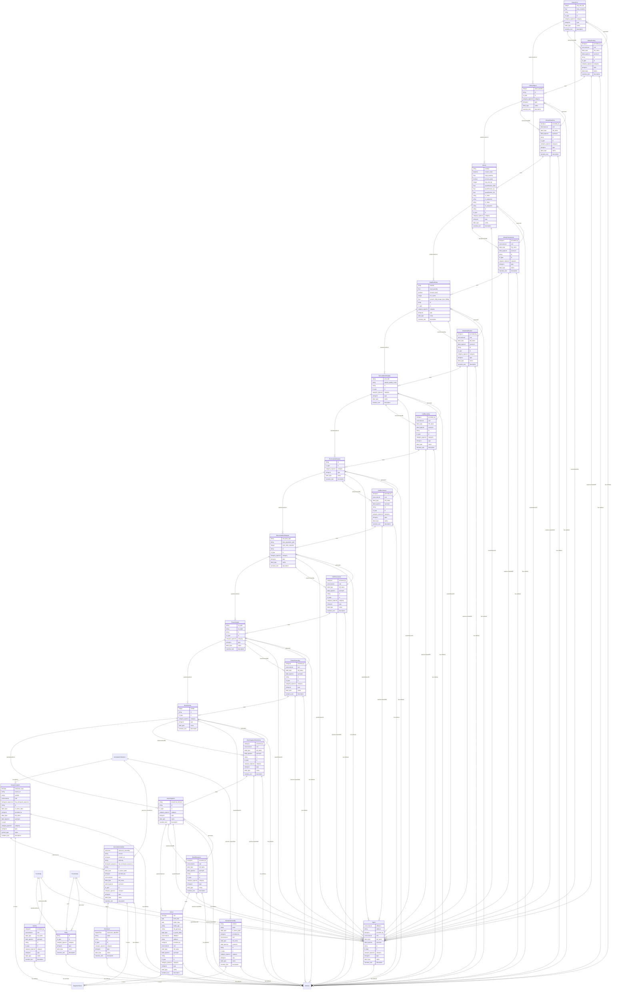

```mermaid
erDiagram
LibraryPool {
    integer avg_size_bp  
    float tube_contents  
    string id  
    iri_type iri  
    category_typeList category  
    stringList type  
    label_type name  
    narrative_text description  
}
Agent {
    uriorcurieList affiliation  
    string address  
    stringList provided_by  
    uriorcurieList xref  
    label_type full_name  
    label_typeList synonym  
    string id  
    iri_type iri  
    category_typeList category  
    stringList type  
    label_type name  
    narrative_text description  
}
LibraryPooling {
    stringList provided_by  
    uriorcurieList xref  
    label_type full_name  
    label_typeList synonym  
    string id  
    iri_type iri  
    category_typeList category  
    stringList type  
    label_type name  
    narrative_text description  
}
LibraryAliquot {
    integer input_quantity  
    string id  
    iri_type iri  
    category_typeList category  
    stringList type  
    label_type name  
    narrative_text description  
}
LibraryAliquoting {
    stringList provided_by  
    uriorcurieList xref  
    label_type full_name  
    label_typeList synonym  
    string id  
    iri_type iri  
    category_typeList category  
    stringList type  
    label_type name  
    narrative_text description  
}
Library {
    string method  
    datetime creation_date  
    float input_quantity  
    boolean process_pass  
    integer avg_size_bp  
    float quantification_fmol  
    float quantification_ng  
    float quantification_nm  
    string r1_index  
    string r1_sequence  
    string r2_index  
    string r2_sequence  
    string id  
    iri_type iri  
    category_typeList category  
    stringList type  
    label_type name  
    narrative_text description  
}
LibraryConstruction {
    stringList provided_by  
    uriorcurieList xref  
    label_type full_name  
    label_typeList synonym  
    string id  
    iri_type iri  
    category_typeList category  
    stringList type  
    label_type name  
    narrative_text description  
}
AmplifiedCdna {
    string method  
    float input_quantity  
    boolean process_pass  
    integer pcr_cycles  
    float percent_cdna_longer_than_400bp  
    string id  
    iri_type iri  
    category_typeList category  
    stringList type  
    label_type name  
    narrative_text description  
}
CdnaAmplification {
    stringList provided_by  
    uriorcurieList xref  
    label_type full_name  
    label_typeList synonym  
    string id  
    iri_type iri  
    category_typeList category  
    stringList type  
    label_type name  
    narrative_text description  
}
BarcodedCellSample {
    string port_well  
    string sample_quality_count  
    string id  
    iri_type iri  
    category_typeList category  
    stringList type  
    label_type name  
    narrative_text description  
}
CellBarcoding {
    stringList provided_by  
    uriorcurieList xref  
    label_type full_name  
    label_typeList synonym  
    string id  
    iri_type iri  
    category_typeList category  
    stringList type  
    label_type name  
    narrative_text description  
}
EnrichedCellSample {
    string id  
    iri_type iri  
    category_typeList category  
    stringList type  
    label_type name  
    narrative_text description  
}
CellEnrichment {
    stringList provided_by  
    uriorcurieList xref  
    label_type full_name  
    label_typeList synonym  
    string id  
    iri_type iri  
    category_typeList category  
    stringList type  
    label_type name  
    narrative_text description  
}
DissociatedCellSample {
    string cell_prep_type  
    string facs_population_plan  
    integer num_cells_collected  
    string id  
    iri_type iri  
    category_typeList category  
    stringList type  
    label_type name  
    narrative_text description  
}
CellDissociation {
    stringList provided_by  
    uriorcurieList xref  
    label_type full_name  
    label_typeList synonym  
    string id  
    iri_type iri  
    category_typeList category  
    stringList type  
    label_type name  
    narrative_text description  
}
TissueSample {
    string roi_plan  
    string roi_label  
    string id  
    iri_type iri  
    category_typeList category  
    stringList type  
    label_type name  
    narrative_text description  
}
TissueDissecting {
    stringList provided_by  
    uriorcurieList xref  
    label_type full_name  
    label_typeList synonym  
    string id  
    iri_type iri  
    category_typeList category  
    stringList type  
    label_type name  
    narrative_text description  
}
BrainSection {
    integer ordinal  
    string id  
    iri_type iri  
    category_typeList category  
    stringList type  
    label_type name  
    narrative_text description  
}
BrainSegmentSectioning {
    stringList provided_by  
    uriorcurieList xref  
    label_type full_name  
    label_typeList synonym  
    string id  
    iri_type iri  
    category_typeList category  
    stringList type  
    label_type name  
    narrative_text description  
}
BrainSegment {
    string anatomical_division  
    string id  
    iri_type iri  
    category_typeList category  
    stringList type  
    label_type name  
    narrative_text description  
}
BrainExtraction {
    stringList provided_by  
    uriorcurieList xref  
    label_type full_name  
    label_typeList synonym  
    string id  
    iri_type iri  
    category_typeList category  
    stringList type  
    label_type name  
    narrative_text description  
}
Donor {
    SexType sex  
    date birth_date  
    date death_date  
    string death_age  
    string full_genotype  
    label_type in_taxon_label  
    uriorcurieList affiliation  
    string address  
    stringList provided_by  
    uriorcurieList xref  
    label_type full_name  
    label_typeList synonym  
    string id  
    iri_type iri  
    category_typeList category  
    stringList type  
    label_type name  
    narrative_text description  
}
ProvEntity {

}
Activity {
    stringList provided_by  
    uriorcurieList xref  
    label_type full_name  
    label_typeList synonym  
    string id  
    iri_type iri  
    category_typeList category  
    stringList type  
    label_type name  
    narrative_text description  
}
Entity {
    string id  
    iri_type iri  
    category_typeList category  
    stringList type  
    label_type name  
    narrative_text description  
}
ProvActivity {

}
AnnotationCollection {

}
GenomeAssembly {
    string version  
    string strain  
    label_type in_taxon_label  
    stringList provided_by  
    uriorcurieList xref  
    label_type full_name  
    label_typeList synonym  
    string id  
    iri_type iri  
    category_typeList category  
    stringList type  
    label_type name  
    narrative_text description  
}
GenomeAnnotation {
    uriorcurie reference_assembly  
    string version  
    stringList content_url  
    string authority  
    biological_sequence has_biological_sequence  
    string id  
    label_type in_taxon_label  
    stringList provided_by  
    uriorcurieList xref  
    label_type full_name  
    label_typeList synonym  
    iri_type iri  
    category_typeList category  
    stringList type  
    label_type name  
    narrative_text description  
}
GeneAnnotation {
    BioType molecular_type  
    string source_id  
    string symbol  
    uriorcurieList xref  
    biological_sequence has_biological_sequence  
    string id  
    label_type in_taxon_label  
    stringList provided_by  
    label_type full_name  
    label_typeList synonym  
    iri_type iri  
    category_typeList category  
    stringList type  
    symbol_type name  
    narrative_text description  
}
Checksum {
    DigestType checksum_algorithm  
    string value  
    string id  
    iri_type iri  
    category_typeList category  
    stringList type  
    label_type name  
    narrative_text description  
}

LibraryPool ||--}o LibraryAliquot : "wasDerivedFrom"
LibraryPool ||--}o LibraryPooling : "wasGeneratedBy"
LibraryPool ||--}o Agent : "wasAttributedTo"
LibraryPool ||--}o Attribute : "has attribute"
Agent ||--}o Attribute : "has attribute"
LibraryPooling ||--}o LibraryAliquot : "used"
LibraryPooling ||--}o LibraryPool : "generated"
LibraryPooling ||--}o Agent : "wasAssociatedWith"
LibraryPooling ||--}o Attribute : "has attribute"
LibraryAliquot ||--}o Library : "wasDerivedFrom"
LibraryAliquot ||--}o LibraryAliquoting : "wasGeneratedBy"
LibraryAliquot ||--}o Agent : "wasAttributedTo"
LibraryAliquot ||--}o Attribute : "has attribute"
LibraryAliquoting ||--}o Library : "used"
LibraryAliquoting ||--}o LibraryAliquot : "generated"
LibraryAliquoting ||--}o Agent : "wasAssociatedWith"
LibraryAliquoting ||--}o Attribute : "has attribute"
Library ||--}o AmplifiedCdna : "wasDerivedFrom"
Library ||--}o LibraryConstruction : "wasGeneratedBy"
Library ||--}o Agent : "wasAttributedTo"
Library ||--}o Attribute : "has attribute"
LibraryConstruction ||--}o AmplifiedCdna : "used"
LibraryConstruction ||--}o Library : "generated"
LibraryConstruction ||--}o Agent : "wasAssociatedWith"
LibraryConstruction ||--}o Attribute : "has attribute"
AmplifiedCdna ||--}o BarcodedCellSample : "wasDerivedFrom"
AmplifiedCdna ||--}o CdnaAmplification : "wasGeneratedBy"
AmplifiedCdna ||--}o Agent : "wasAttributedTo"
AmplifiedCdna ||--}o Attribute : "has attribute"
CdnaAmplification ||--}o BarcodedCellSample : "used"
CdnaAmplification ||--}o AmplifiedCdna : "generated"
CdnaAmplification ||--}o Agent : "wasAssociatedWith"
CdnaAmplification ||--}o Attribute : "has attribute"
BarcodedCellSample ||--}o EnrichedCellSample : "wasDerivedFrom"
BarcodedCellSample ||--}o CellBarcoding : "wasGeneratedBy"
BarcodedCellSample ||--}o Agent : "wasAttributedTo"
BarcodedCellSample ||--}o Attribute : "has attribute"
CellBarcoding ||--}o EnrichedCellSample : "used"
CellBarcoding ||--}o BarcodedCellSample : "generated"
CellBarcoding ||--}o Agent : "wasAssociatedWith"
CellBarcoding ||--}o Attribute : "has attribute"
EnrichedCellSample ||--}o DissociatedCellSample : "wasDerivedFrom"
EnrichedCellSample ||--}o CellEnrichment : "wasGeneratedBy"
EnrichedCellSample ||--}o Agent : "wasAttributedTo"
EnrichedCellSample ||--}o Attribute : "has attribute"
CellEnrichment ||--}o DissociatedCellSample : "used"
CellEnrichment ||--}o EnrichedCellSample : "generated"
CellEnrichment ||--}o Agent : "wasAssociatedWith"
CellEnrichment ||--}o Attribute : "has attribute"
DissociatedCellSample ||--}o TissueSample : "wasDerivedFrom"
DissociatedCellSample ||--}o CellDissociation : "wasGeneratedBy"
DissociatedCellSample ||--}o Agent : "wasAttributedTo"
DissociatedCellSample ||--}o Attribute : "has attribute"
CellDissociation ||--}o TissueSample : "used"
CellDissociation ||--}o DissociatedCellSample : "generated"
CellDissociation ||--}o Agent : "wasAssociatedWith"
CellDissociation ||--}o Attribute : "has attribute"
TissueSample ||--}o BrainSection : "wasDerivedFrom"
TissueSample ||--}o TissueDissecting : "wasGeneratedBy"
TissueSample ||--}o Agent : "wasAttributedTo"
TissueSample ||--}o Attribute : "has attribute"
TissueDissecting ||--}o BrainSection : "used"
TissueDissecting ||--}o TissueSample : "generated"
TissueDissecting ||--}o Agent : "wasAssociatedWith"
TissueDissecting ||--}o Attribute : "has attribute"
BrainSection ||--}o BrainSegment : "wasDerivedFrom"
BrainSection ||--}o BrainSegmentSectioning : "wasGeneratedBy"
BrainSection ||--}o Agent : "wasAttributedTo"
BrainSection ||--}o Attribute : "has attribute"
BrainSegmentSectioning ||--}o BrainSegment : "used"
BrainSegmentSectioning ||--}o BrainSection : "generated"
BrainSegmentSectioning ||--}o Agent : "wasAssociatedWith"
BrainSegmentSectioning ||--}o Attribute : "has attribute"
BrainSegment ||--}o Donor : "wasDerivedFrom"
BrainSegment ||--}o BrainExtraction : "wasGeneratedBy"
BrainSegment ||--}o Agent : "wasAttributedTo"
BrainSegment ||--}o Attribute : "has attribute"
BrainExtraction ||--}o Donor : "used"
BrainExtraction ||--}o BrainSegment : "generated"
BrainExtraction ||--}o Agent : "wasAssociatedWith"
BrainExtraction ||--}o Attribute : "has attribute"
Donor ||--}o OrganismTaxon : "in taxon"
Donor ||--}o Attribute : "has attribute"
ProvEntity ||--}o Entity : "wasDerivedFrom"
ProvEntity ||--}o Activity : "wasGeneratedBy"
ProvEntity ||--}o Agent : "wasAttributedTo"
Activity ||--}o Attribute : "has attribute"
Entity ||--}o Attribute : "has attribute"
ProvActivity ||--}o Entity : "used"
ProvActivity ||--}o Entity : "generated"
ProvActivity ||--}o Agent : "wasAssociatedWith"
AnnotationCollection ||--}o GeneAnnotation : "annotations"
AnnotationCollection ||--}o GenomeAnnotation : "genome_annotations"
AnnotationCollection ||--}o GenomeAssembly : "genome_assemblies"
GenomeAssembly ||--}o OrganismTaxon : "in taxon"
GenomeAssembly ||--}o Attribute : "has attribute"
GenomeAnnotation ||--}| Checksum : "digest"
GenomeAnnotation ||--}o OrganismTaxon : "in taxon"
GenomeAnnotation ||--}o Attribute : "has attribute"
GeneAnnotation ||--|o GenomeAnnotation : "referenced in"
GeneAnnotation ||--}o OrganismTaxon : "in taxon"
GeneAnnotation ||--}o Attribute : "has attribute"
Checksum ||--}o Attribute : "has attribute"

```

