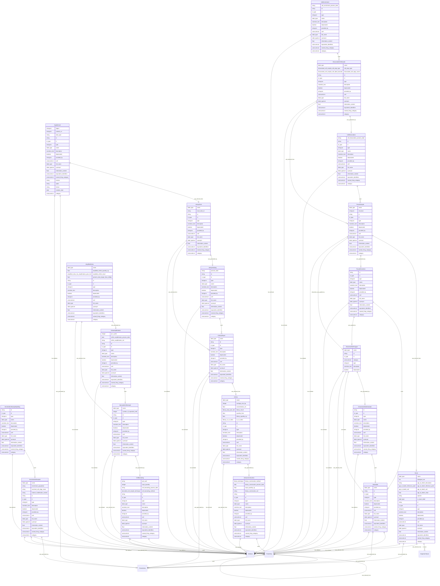

```mermaid
erDiagram
DigitalAsset {
    stringList digest  
    stringList content_url  
    string data_type  
    string id  
    iri_type iri  
    stringList type  
    label_type name  
    narrative_text description  
    boolean deprecated  
    stringList provided_by  
    uriorcurieList xref  
    label_type full_name  
    label_typeList synonym  
    float information_content  
    uriorcurieList equivalent_identifiers  
    uriorcurieList named_thing_category  
    string license  
    string rights  
    string format  
    date creation_date  
    uriorcurieList category  
}
ProvActivity {

}
ProvEntity {

}
DissectionRoiPolygon {
    label_type name  
    string id  
    iri_type iri  
    uriorcurieList category  
    stringList type  
    narrative_text description  
    boolean deprecated  
}
LibraryPooling {
    string process_date  
    string id  
    iri_type iri  
    stringList type  
    label_type name  
    narrative_text description  
    boolean deprecated  
    stringList provided_by  
    uriorcurieList xref  
    label_type full_name  
    label_typeList synonym  
    float information_content  
    uriorcurieList equivalent_identifiers  
    uriorcurieList named_thing_category  
    uriorcurieList category  
}
LibraryConstruction {
    library_technique library_construction_method  
    date library_construction_process_date  
    float input_quantity_ng  
    string library_construction_set  
    string id  
    iri_type iri  
    stringList type  
    label_type name  
    narrative_text description  
    boolean deprecated  
    stringList provided_by  
    uriorcurieList xref  
    label_type full_name  
    label_typeList synonym  
    float information_content  
    uriorcurieList equivalent_identifiers  
    uriorcurieList named_thing_category  
    uriorcurieList category  
}
CdnaAmplification {
    integer pcr_cycles  
    date cDNA_amplification_process_date  
    string cDNA_amplification_set  
    string id  
    iri_type iri  
    stringList type  
    label_type name  
    narrative_text description  
    boolean deprecated  
    stringList provided_by  
    uriorcurieList xref  
    label_type full_name  
    label_typeList synonym  
    float information_content  
    uriorcurieList equivalent_identifiers  
    uriorcurieList named_thing_category  
    uriorcurieList category  
}
CellBarcoding {
    string port_well  
    integer input_quantity  
    string cell_barcoding_process_date  
    barcoded_cell_sample_technique cell_barcoding_method  
    string id  
    iri_type iri  
    stringList type  
    label_type name  
    narrative_text description  
    boolean deprecated  
    stringList provided_by  
    uriorcurieList xref  
    label_type full_name  
    label_typeList synonym  
    float information_content  
    uriorcurieList equivalent_identifiers  
    uriorcurieList named_thing_category  
    uriorcurieList category  
}
EnrichedCellSampleSplitting {
    string id  
    iri_type iri  
    stringList type  
    label_type name  
    narrative_text description  
    boolean deprecated  
    stringList provided_by  
    uriorcurieList xref  
    label_type full_name  
    label_typeList synonym  
    float information_content  
    uriorcurieList equivalent_identifiers  
    uriorcurieList named_thing_category  
    uriorcurieList category  
}
CellEnrichment {
    string cell_enrichment_process_date  
    string id  
    iri_type iri  
    stringList type  
    label_type name  
    narrative_text description  
    boolean deprecated  
    stringList provided_by  
    uriorcurieList xref  
    label_type full_name  
    label_typeList synonym  
    float information_content  
    uriorcurieList equivalent_identifiers  
    uriorcurieList named_thing_category  
    uriorcurieList category  
}
CellDissociation {
    string cell_dissociation_process_date  
    string id  
    iri_type iri  
    stringList type  
    label_type name  
    narrative_text description  
    boolean deprecated  
    stringList provided_by  
    uriorcurieList xref  
    label_type full_name  
    label_typeList synonym  
    float information_content  
    uriorcurieList equivalent_identifiers  
    uriorcurieList named_thing_category  
    uriorcurieList category  
}
TissueDissection {
    string id  
    iri_type iri  
    stringList type  
    label_type name  
    narrative_text description  
    boolean deprecated  
    stringList provided_by  
    uriorcurieList xref  
    label_type full_name  
    label_typeList synonym  
    float information_content  
    uriorcurieList equivalent_identifiers  
    uriorcurieList named_thing_category  
    uriorcurieList category  
}
DissectionRoiDelineation {
    string id  
    iri_type iri  
    stringList type  
    label_type name  
    narrative_text description  
    boolean deprecated  
    stringList provided_by  
    uriorcurieList xref  
    label_type full_name  
    label_typeList synonym  
    float information_content  
    uriorcurieList equivalent_identifiers  
    uriorcurieList named_thing_category  
    uriorcurieList category  
}
LibraryPool {
    label_type name  
    string local_tube_id  
    string id  
    iri_type iri  
    stringList type  
    narrative_text description  
    boolean deprecated  
    stringList provided_by  
    uriorcurieList xref  
    label_type full_name  
    label_typeList synonym  
    float information_content  
    uriorcurieList equivalent_identifiers  
    uriorcurieList named_thing_category  
    uriorcurieList category  
}
LibraryAliquot {
    label_type name  
    string id  
    iri_type iri  
    stringList type  
    narrative_text description  
    boolean deprecated  
    stringList provided_by  
    uriorcurieList xref  
    label_type full_name  
    label_typeList synonym  
    float information_content  
    uriorcurieList equivalent_identifiers  
    uriorcurieList named_thing_category  
    uriorcurieList category  
}
Library {
    label_type name  
    integer average_size_bp  
    float concentration_nm  
    library_prep_pass_fail library_result  
    float quantity_fmol  
    float library_quantity_ng  
    library_r1_r2_index r1_r2_index  
    string id  
    iri_type iri  
    stringList type  
    narrative_text description  
    boolean deprecated  
    stringList provided_by  
    uriorcurieList xref  
    label_type full_name  
    label_typeList synonym  
    float information_content  
    uriorcurieList equivalent_identifiers  
    uriorcurieList named_thing_category  
    uriorcurieList category  
}
AmplifiedCdna {
    label_type name  
    float amplified_cDNA_quantity_ng  
    amplified_cdna_rna_amplification_pass_fail amplified_cDNA_result  
    float percent_cdna_longer_than_400bp  
    string id  
    iri_type iri  
    stringList type  
    narrative_text description  
    boolean deprecated  
    stringList provided_by  
    uriorcurieList xref  
    label_type full_name  
    label_typeList synonym  
    float information_content  
    uriorcurieList equivalent_identifiers  
    uriorcurieList named_thing_category  
    uriorcurieList category  
}
BarcodedCellSample {
    label_type name  
    integer number_of_expected_cells  
    string id  
    iri_type iri  
    stringList type  
    narrative_text description  
    boolean deprecated  
    stringList provided_by  
    uriorcurieList xref  
    label_type full_name  
    label_typeList synonym  
    float information_content  
    uriorcurieList equivalent_identifiers  
    uriorcurieList named_thing_category  
    uriorcurieList category  
}
EnrichedCellSample {
    label_type name  
    string enrichment_population  
    string enriched_cell_oligo_name  
    string histone_modification_marker  
    string id  
    iri_type iri  
    stringList type  
    narrative_text description  
    boolean deprecated  
    stringList provided_by  
    uriorcurieList xref  
    label_type full_name  
    label_typeList synonym  
    float information_content  
    uriorcurieList equivalent_identifiers  
    uriorcurieList named_thing_category  
    uriorcurieList category  
}
DissociatedCellSample {
    label_type name  
    dissociated_cell_sample_cell_prep_type cell_prep_type  
    dissociated_cell_sample_cell_label_barcode dissociated_cell_oligo_name  
    string id  
    iri_type iri  
    stringList type  
    narrative_text description  
    boolean deprecated  
    stringList provided_by  
    uriorcurieList xref  
    label_type full_name  
    label_typeList synonym  
    float information_content  
    uriorcurieList equivalent_identifiers  
    uriorcurieList named_thing_category  
    uriorcurieList category  
}
TissueSample {
    label_type name  
    stringList structure  
    string id  
    iri_type iri  
    stringList type  
    narrative_text description  
    boolean deprecated  
    stringList provided_by  
    uriorcurieList xref  
    label_type full_name  
    label_typeList synonym  
    float information_content  
    uriorcurieList equivalent_identifiers  
    uriorcurieList named_thing_category  
    uriorcurieList category  
}
BrainSlab {
    label_type name  
    string id  
    iri_type iri  
    stringList type  
    narrative_text description  
    boolean deprecated  
    stringList provided_by  
    uriorcurieList xref  
    label_type full_name  
    label_typeList synonym  
    float information_content  
    uriorcurieList equivalent_identifiers  
    uriorcurieList named_thing_category  
    uriorcurieList category  
}
Donor {
    label_type name  
    sex biological_sex  
    string age_at_death_description  
    age_at_death_reference_point age_at_death_reference_point  
    age_at_death_unit age_at_death_unit  
    float age_at_death_value  
    string species  
    label_type in_taxon_label  
    string id  
    iri_type iri  
    stringList type  
    narrative_text description  
    boolean deprecated  
    stringList provided_by  
    uriorcurieList xref  
    label_type full_name  
    label_typeList synonym  
    float information_content  
    uriorcurieList equivalent_identifiers  
    uriorcurieList named_thing_category  
    uriorcurieList category  
}

DigitalAsset ||--|o LibraryPool : "was_derived_from"
DigitalAsset ||--|o ProvActivity : "was_generated_by"
DigitalAsset ||--}o Attribute : "has attribute"
ProvActivity ||--|o ProvEntity : "used"
ProvEntity ||--|o ProvEntity : "was_derived_from"
ProvEntity ||--|o ProvActivity : "was_generated_by"
DissectionRoiPolygon ||--|o DissectionRoiDelineation : "was_generated_by"
DissectionRoiPolygon ||--|o BrainSlab : "annotates"
DissectionRoiPolygon ||--|o ProvEntity : "was_derived_from"
DissectionRoiPolygon ||--}o Attribute : "has attribute"
LibraryPooling ||--}o LibraryAliquot : "used"
LibraryPooling ||--}o Attribute : "has attribute"
LibraryConstruction ||--|o ProvEntity : "used"
LibraryConstruction ||--}o Attribute : "has attribute"
CdnaAmplification ||--|o BarcodedCellSample : "used"
CdnaAmplification ||--}o Attribute : "has attribute"
CellBarcoding ||--}o ProvEntity : "used"
CellBarcoding ||--}o Attribute : "has attribute"
EnrichedCellSampleSplitting ||--|o EnrichedCellSample : "used"
EnrichedCellSampleSplitting ||--}o Attribute : "has attribute"
CellEnrichment ||--}o DissociatedCellSample : "used"
CellEnrichment ||--}o Attribute : "has attribute"
CellDissociation ||--}o TissueSample : "used"
CellDissociation ||--}o Attribute : "has attribute"
TissueDissection ||--|o BrainSlab : "used"
TissueDissection ||--|o DissectionRoiPolygon : "was_guided_by"
TissueDissection ||--}o Attribute : "has attribute"
DissectionRoiDelineation ||--|o BrainSlab : "used"
DissectionRoiDelineation ||--}o Attribute : "has attribute"
LibraryPool ||--|o LibraryPooling : "was_generated_by"
LibraryPool ||--}o LibraryAliquot : "was_derived_from"
LibraryPool ||--}o Attribute : "has attribute"
LibraryAliquot ||--|o Library : "was_derived_from"
LibraryAliquot ||--|o ProvActivity : "was_generated_by"
LibraryAliquot ||--}o Attribute : "has attribute"
Library ||--|o LibraryConstruction : "was_generated_by"
Library ||--|o ProvEntity : "was_derived_from"
Library ||--}o Attribute : "has attribute"
AmplifiedCdna ||--|o CdnaAmplification : "was_generated_by"
AmplifiedCdna ||--|o BarcodedCellSample : "was_derived_from"
AmplifiedCdna ||--}o Attribute : "has attribute"
BarcodedCellSample ||--|o CellBarcoding : "was_generated_by"
BarcodedCellSample ||--}o ProvEntity : "was_derived_from"
BarcodedCellSample ||--}o Attribute : "has attribute"
EnrichedCellSample ||--|o ProvActivity : "was_generated_by"
EnrichedCellSample ||--}o ProvEntity : "was_derived_from"
EnrichedCellSample ||--}o Attribute : "has attribute"
DissociatedCellSample ||--|o CellDissociation : "was_generated_by"
DissociatedCellSample ||--}o TissueSample : "was_derived_from"
DissociatedCellSample ||--}o Attribute : "has attribute"
TissueSample ||--|o Donor : "was_derived_from"
TissueSample ||--|o TissueDissection : "was_generated_by"
TissueSample ||--|o DissectionRoiPolygon : "dissection_was_guided_by"
TissueSample ||--}o Attribute : "has attribute"
BrainSlab ||--|o ProvEntity : "was_derived_from"
BrainSlab ||--|o ProvActivity : "was_generated_by"
BrainSlab ||--}o Attribute : "has attribute"
Donor ||--}o OrganismTaxon : "in taxon"
Donor ||--|o ProvEntity : "was_derived_from"
Donor ||--|o ProvActivity : "was_generated_by"
Donor ||--}o Attribute : "has attribute"

```

