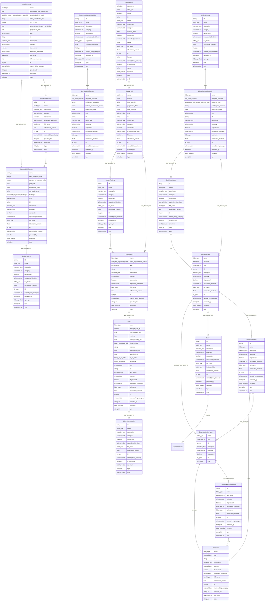

```mermaid
erDiagram
AmplifiedCdna {
    label_type name  
    float amplified_cDNA_quantity_ng  
    amplified_cdna_rna_amplification_pass_fail amplified_cDNA_result  
    string cdna_amplification_set  
    integer pcr_cycles  
    float percent_cdna_longer_than_400bp  
    date preparation_date  
    uriorcurieList xref  
    string id  
    narrative_text description  
    uriorcurieList category  
    boolean deprecated  
    uriorcurieList equivalent_identifiers  
    label_type full_name  
    float information_content  
    iri_type iri  
    uriorcurieList named_thing_category  
    stringList provided_by  
    label_typeList synonym  
    stringList type  
}
BarcodedCellSample {
    label_type name  
    integer input_quantity_count  
    integer number_of_expected_cells  
    string port_well  
    date preparation_date  
    string tag_local_name  
    barcoded_cell_sample_technique technique  
    uriorcurieList xref  
    string id  
    narrative_text description  
    uriorcurieList category  
    boolean deprecated  
    uriorcurieList equivalent_identifiers  
    label_type full_name  
    float information_content  
    iri_type iri  
    uriorcurieList named_thing_category  
    stringList provided_by  
    label_typeList synonym  
    stringList type  
}
BrainSlab {
    label_type name  
    uriorcurieList xref  
    string id  
    narrative_text description  
    uriorcurieList category  
    boolean deprecated  
    uriorcurieList equivalent_identifiers  
    label_type full_name  
    float information_content  
    iri_type iri  
    uriorcurieList named_thing_category  
    stringList provided_by  
    label_typeList synonym  
    stringList type  
}
CdnaAmplification {
    string id  
    label_type name  
    narrative_text description  
    uriorcurieList category  
    boolean deprecated  
    uriorcurieList equivalent_identifiers  
    label_type full_name  
    float information_content  
    iri_type iri  
    uriorcurieList named_thing_category  
    stringList provided_by  
    label_typeList synonym  
    stringList type  
    uriorcurieList xref  
}
CellBarcoding {
    string id  
    label_type name  
    narrative_text description  
    uriorcurieList category  
    boolean deprecated  
    uriorcurieList equivalent_identifiers  
    label_type full_name  
    float information_content  
    iri_type iri  
    uriorcurieList named_thing_category  
    stringList provided_by  
    label_typeList synonym  
    stringList type  
    uriorcurieList xref  
}
CellDissociation {
    string id  
    label_type name  
    narrative_text description  
    uriorcurieList category  
    boolean deprecated  
    uriorcurieList equivalent_identifiers  
    label_type full_name  
    float information_content  
    iri_type iri  
    uriorcurieList named_thing_category  
    stringList provided_by  
    label_typeList synonym  
    stringList type  
    uriorcurieList xref  
}
CellEnrichment {
    string id  
    label_type name  
    narrative_text description  
    uriorcurieList category  
    boolean deprecated  
    uriorcurieList equivalent_identifiers  
    label_type full_name  
    float information_content  
    iri_type iri  
    uriorcurieList named_thing_category  
    stringList provided_by  
    label_typeList synonym  
    stringList type  
    uriorcurieList xref  
}
DigitalAsset {
    stringList content_url  
    string data_type  
    stringList digest  
    string id  
    label_type name  
    narrative_text description  
    uriorcurieList category  
    date creation_date  
    boolean deprecated  
    uriorcurieList equivalent_identifiers  
    string format  
    label_type full_name  
    float information_content  
    iri_type iri  
    string license  
    uriorcurieList named_thing_category  
    stringList provided_by  
    string rights  
    label_typeList synonym  
    stringList type  
    uriorcurieList xref  
}
DissectionRoiDelineation {
    string id  
    label_type name  
    narrative_text description  
    uriorcurieList category  
    boolean deprecated  
    uriorcurieList equivalent_identifiers  
    label_type full_name  
    float information_content  
    iri_type iri  
    uriorcurieList named_thing_category  
    stringList provided_by  
    label_typeList synonym  
    stringList type  
    uriorcurieList xref  
}
DissectionRoiPolygon {
    label_type name  
    uriorcurieList xref  
    string id  
    narrative_text description  
    uriorcurieList category  
    boolean deprecated  
    iri_type iri  
    stringList type  
}
DissociatedCellSample {
    label_type name  
    cell_label_barcode cell_label_barcode  
    dissociated_cell_sample_cell_prep_type cell_prep_type  
    string patched_cell_structure  
    date preparation_date  
    uriorcurieList xref  
    string id  
    narrative_text description  
    uriorcurieList category  
    boolean deprecated  
    uriorcurieList equivalent_identifiers  
    label_type full_name  
    float information_content  
    iri_type iri  
    uriorcurieList named_thing_category  
    stringList provided_by  
    label_typeList synonym  
    stringList type  
}
Donor {
    string id  
    label_type name  
    narrative_text description  
    uriorcurieList category  
    boolean deprecated  
    uriorcurieList equivalent_identifiers  
    label_type full_name  
    label_type in_taxon_label  
    float information_content  
    iri_type iri  
    uriorcurieList named_thing_category  
    stringList provided_by  
    label_typeList synonym  
    stringList type  
    uriorcurieList xref  
}
EnrichedCellSample {
    label_type name  
    cell_label_barcode cell_label_barcode  
    string enrichment_population  
    string histone_modification_marker  
    date preparation_date  
    uriorcurieList xref  
    string id  
    narrative_text description  
    uriorcurieList category  
    boolean deprecated  
    uriorcurieList equivalent_identifiers  
    label_type full_name  
    float information_content  
    iri_type iri  
    uriorcurieList named_thing_category  
    stringList provided_by  
    label_typeList synonym  
    stringList type  
}
EnrichedCellSampleSplitting {
    string id  
    label_type name  
    narrative_text description  
    uriorcurieList category  
    boolean deprecated  
    uriorcurieList equivalent_identifiers  
    label_type full_name  
    float information_content  
    iri_type iri  
    uriorcurieList named_thing_category  
    stringList provided_by  
    label_typeList synonym  
    stringList type  
    uriorcurieList xref  
}
Library {
    label_type name  
    integer average_size_bp  
    float concentration_nm  
    float input_ng  
    float library_quantity_ng  
    library_prep_pass_fail library_result  
    string prep_set  
    date preparation_date  
    float quantity_fmol  
    library_r1_r2_index r1_r2_index  
    library_technique technique  
    uriorcurieList xref  
    string id  
    narrative_text description  
    uriorcurieList category  
    boolean deprecated  
    uriorcurieList equivalent_identifiers  
    label_type full_name  
    float information_content  
    iri_type iri  
    uriorcurieList named_thing_category  
    stringList provided_by  
    label_typeList synonym  
    stringList type  
}
LibraryAliquot {
    label_type name  
    fastq_file_alignment_status fastq_file_alignment_status  
    uriorcurieList xref  
    string id  
    narrative_text description  
    uriorcurieList category  
    boolean deprecated  
    uriorcurieList equivalent_identifiers  
    label_type full_name  
    float information_content  
    iri_type iri  
    uriorcurieList named_thing_category  
    stringList provided_by  
    label_typeList synonym  
    stringList type  
}
LibraryConstruction {
    string id  
    label_type name  
    narrative_text description  
    uriorcurieList category  
    boolean deprecated  
    uriorcurieList equivalent_identifiers  
    label_type full_name  
    float information_content  
    iri_type iri  
    uriorcurieList named_thing_category  
    stringList provided_by  
    label_typeList synonym  
    stringList type  
    uriorcurieList xref  
}
LibraryPool {
    label_type name  
    string flowcell  
    string local_tube_id  
    date preparation_date  
    string tube_barcode  
    uriorcurieList xref  
    string id  
    narrative_text description  
    uriorcurieList category  
    boolean deprecated  
    uriorcurieList equivalent_identifiers  
    label_type full_name  
    float information_content  
    iri_type iri  
    uriorcurieList named_thing_category  
    stringList provided_by  
    label_typeList synonym  
    stringList type  
}
LibraryPooling {
    string id  
    label_type name  
    narrative_text description  
    uriorcurieList category  
    boolean deprecated  
    uriorcurieList equivalent_identifiers  
    label_type full_name  
    float information_content  
    iri_type iri  
    uriorcurieList named_thing_category  
    stringList provided_by  
    label_typeList synonym  
    stringList type  
    uriorcurieList xref  
}
TissueDissection {
    string id  
    label_type name  
    narrative_text description  
    uriorcurieList category  
    boolean deprecated  
    uriorcurieList equivalent_identifiers  
    label_type full_name  
    float information_content  
    iri_type iri  
    uriorcurieList named_thing_category  
    stringList provided_by  
    label_typeList synonym  
    stringList type  
    uriorcurieList xref  
}
TissueSample {
    label_type name  
    stringList structure  
    uriorcurieList xref  
    string id  
    narrative_text description  
    uriorcurieList category  
    boolean deprecated  
    uriorcurieList equivalent_identifiers  
    label_type full_name  
    float information_content  
    iri_type iri  
    uriorcurieList named_thing_category  
    stringList provided_by  
    label_typeList synonym  
    stringList type  
}

AmplifiedCdna ||--|o BarcodedCellSample : "was_derived_from"
AmplifiedCdna ||--|o CdnaAmplification : "was_generated_by"
BarcodedCellSample ||--|o CellBarcoding : "was_generated_by"
CdnaAmplification ||--|o BarcodedCellSample : "used"
CellDissociation ||--}o TissueSample : "used"
CellEnrichment ||--}o DissociatedCellSample : "used"
DigitalAsset ||--|o LibraryPool : "was_derived_from"
DissectionRoiDelineation ||--|o BrainSlab : "used"
DissectionRoiPolygon ||--|o BrainSlab : "annotates"
DissectionRoiPolygon ||--|o DissectionRoiDelineation : "was_generated_by"
DissociatedCellSample ||--|o CellDissociation : "was_generated_by"
DissociatedCellSample ||--}o TissueSample : "was_derived_from"
Donor ||--}o OrganismTaxon : "in taxon"
EnrichedCellSampleSplitting ||--|o EnrichedCellSample : "used"
Library ||--|o LibraryConstruction : "was_generated_by"
LibraryAliquot ||--|o Library : "was_derived_from"
LibraryPool ||--|o LibraryPooling : "was_generated_by"
LibraryPool ||--}o LibraryAliquot : "was_derived_from"
LibraryPooling ||--}o LibraryAliquot : "used"
TissueDissection ||--|o BrainSlab : "used"
TissueDissection ||--|o DissectionRoiPolygon : "was_guided_by"
TissueSample ||--|o DissectionRoiPolygon : "dissection_was_guided_by"
TissueSample ||--|o Donor : "was_derived_from"
TissueSample ||--|o TissueDissection : "was_generated_by"

```
